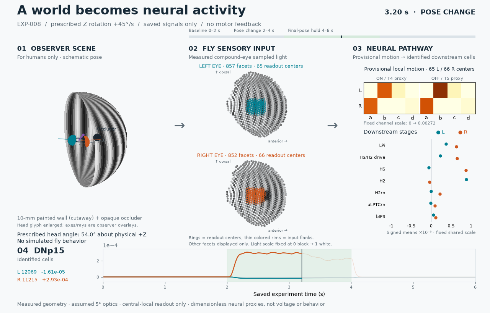

# EXP-008: synchronized world-to-neural observer



[Static overview at 3.20 s](../figures/EXP-008-observer-overview.png)
· [Scientific result and limitations](../reports/EXP-008-compound-eye.md)

This is a **post-hoc visualization**, not another experiment. It reads the
unchanged EXP-008 sensor/neural bundle and reconstructs its prescribed scene
for humans. No observer output enters a sensor, motion kernel or neural model.
The canonical condition prescribes +45°/s head rotation about physical +Z
between 2 and 4 s. This is not simulated behavior or a steering command.

## Panels

1. **Observer scene:** the textured 10-mm spherical wall and opaque foreground
   sphere use the frozen scene description. The near wall hemisphere is omitted
   **only in this observer cutaway**, so the pose is visible. The head outline is
   schematic; lens-position glyphs are enlarged fivefold. The purple heading,
   dashed +X reference and two representative measured viewing axes are layered
   observer overlays, not a physical head mesh or a rendering of receptor optics.
   EXP-008 sampled the full wall and its actual external occlusion, not this view.
2. **Fly sensory input:** each dot represents one of the **857 left / 852 right
   measured viewing directions**, colored directly by its saved scalar light
   sample. The Lambert equal-area projection is centered on each lateral eye
   axis (±Y); +X anterior is rightwards and +Z dorsal upwards in both panels.
   No rays are reflected, remeshed onto regular pixels, or interpolated between
   facets. These are compound-eye sampled-light maps, **not subjective fly
   photographs**. The fixed light scale is 0 black to 1 white.
3. **Provisional motion and downstream stages:** colored rings mark the
   **65 L / 66 R central-local readout centers**; thinner rims mark the additional
   neighbors used by their actual correlator pairs (87 L / 88 R distinct input
   facets including centers). Other facets remain display-only. The 16 saved
   motion channels are shown as left/right ON–T4 and OFF–T5 a/b/c/d proxies, with
   one fixed scale for the entire movie. This does **not** reconstruct peripheral
   preferred-direction fields or individual T4/T5 retinotopy. Downstream dots
   are signed arithmetic side means of saved LPi states, HS/H2 projected input,
   and central HS, H2, H2rn, uLPTCrn and bIPS states. The shared axis is displayed
   in units of 10⁻³; neither signs nor amplitudes are normalized per frame.
   L/R follows the frozen neuron annotations, not necessarily the receptive-field
   eye (notably for H2), and is not a motor-action mapping.
4. **DNp15:** the two identified cells, **L 12069 / R 11215**, retain separate raw
   signed traces and current values. Colored history follows the time cursor;
   faint whole-trial traces are post-hoc context, not information available to
   the simulated circuit. All neural quantities are dimensionless proxies, not
   membrane voltage, calibrated fluorescence or muscle recruitment.

The geometry and optical/early-vision assumptions remain those in the
[frozen specification](../experiments/EXP-008-compound-eye/specification.json).
These are measured female microCT eyes (specimen `20240701`,
[Zhao et al., 2025](https://doi.org/10.1038/s41586-025-09276-5)), not the MaleCNS
individual; no facet-to-MaleCNS neuron crosswalk is inferred.
This animation establishes no additional physiology or behavioral claim.

## Timing and reproducibility

The animation contains 100 frames at 16⅔ fps: display times 0–5.94 s, each held
for 60 ms, for the original 6-s trial. Facet values select the last saved 2-ms
sensor sample; neural values select the last saved 0.5-ms sample. These frame
times coincide with both sample axes. **No scientific values are interpolated.**
Plot segments connect exact saved points in the ordinary graphical sense. The
lossless animated PNG also carries a static default image at 3.20 s; that image
is not an extra animation frame and gives non-animating viewers an overview.
Sparse opaque pixel updates over the previous frame reduce file size without
changing any decoded pixel; the first animation frame replaces the whole canvas.

```powershell
.venv/Scripts/python.exe scripts/render_exp008_observer.py --bundle results/exp008_eye_final --promote
.venv/Scripts/python.exe -m pytest -q tests/test_exp008_observer.py tests/test_compound_eye.py tests/test_repository_records.py
```

Use a saved EXP-008 bundle or exact replay bundle, plus the registered local
`data/exp008_eye/geometry.npz`. Their preparation is described in the unchanged
scientific report; rendering needs no anatomy query or new neural run. The
loader checks the complete sensor/neural trace digest against the
[record](../experiments/EXP-008-compound-eye/record.json), exact time axes, measured
geometry, readout endpoints, channel order and neuron IDs. Arrays are read-only.
Tests compare actual artist values with saved samples, reject changed metadata,
and prohibit sensor/neural execution inside the observer.

`results/exp008_observer/render_manifest.json` records input/source/media hashes,
frame times, sample indices and library versions. Repeated rendering is pixel-
and encoded-byte deterministic within the same Matplotlib/Pillow/font environment;
cross-version raster identity is not asserted. Bulk inputs and rendering products
remain ignored. Only the two compact final PNGs are promoted, subject to the
existing 5-MiB-per-file policy; no policy exemption is needed.
