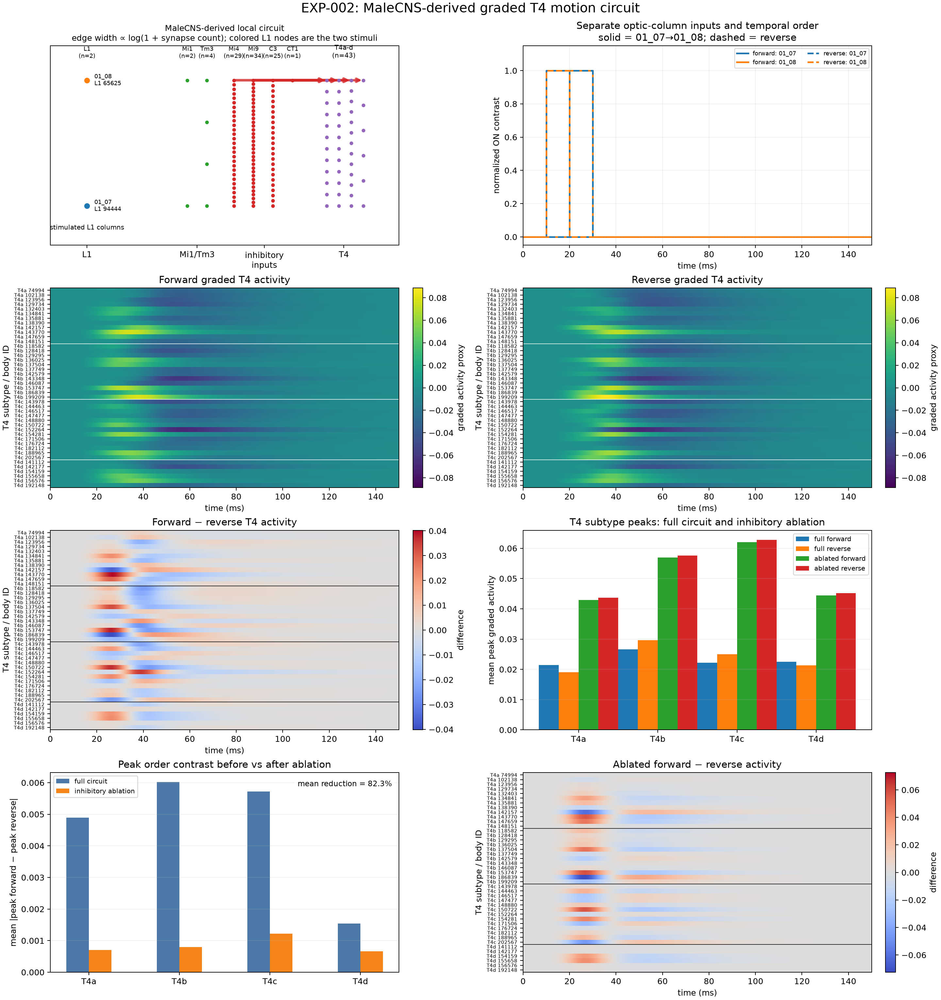

# EXP-002 — graded local T4 motion proxy

**Outcome: reproducible temporal-order sensitivity in the frozen reduced model;
biological direction mapping and mechanism remain unresolved.**

## Question

Can a reduced MaleCNS-derived local T4 circuit distinguish opposite temporal
orders of neighboring optic-column activity?

## What changed from EXP-001

EXP-002 replaces spike-gated propagation with continuous graded state updates,
adds direct T4 input classes Mi4, Mi9, C3, and CT1, and supplies class-specific
sign/timing assumptions motivated qualitatively by early visual physiology.
MaleCNS still supplies neuron identities, directed edges, and synapse counts.

For state `x_i`, each node follows a first-order low pass toward a weighted
input target:

```text
x_i(t+dt) = x_i(t) + dt/tau_i * (target_i(t) - x_i(t))
```

Incoming modeled weights are signed synapse counts normalized by total absolute
modeled input mass per postsynaptic cell. Non-L1 output is rectified. A scalar
two-column coordinate is inferred from retained L1→Mi1/Tm3→T4 path weights.
Mi4/C3/CT1 cells receive an exogenous spatially weighted visual drive delayed
by 15 ms; Mi9 receives no ON-event drive.

## Free parameters

`dt=0.1 ms`; time constants L1 5 ms, Tm3 12 ms, Mi1 20 ms, inhibitory inputs
30 ms, T4 10 ms; inhibitory delay 15 ms; input amplitude 1.0. These exact
numbers are phenomenological assumptions and were frozen at `5dc96b4`; they
are not quantitative fits to measured MaleCNS physiology.

## Result

For right-eye workbook pair `01_07→01_08` versus its reversal:

- all 43 selected T4 cells show some order-dependent model activity;
- mean absolute difference of T4 peak activity: 0.004988822;
- mean T4a peak: 0.021418 forward vs 0.019100 reverse;
- mean T4b peak: 0.026648 forward vs 0.029653 reverse;
- inhibitory-channel ablation contrast: 0.000881584;
- reported contrast reduction: 82.3%.

Eight additional frozen local materializations across both workbook indices
reproduce their recorded mean contrasts and 70.3–94.1% reductions under the
same ablation. This is workbook-coordinate generalization, not validation of a
named visual or body direction.



## Controls and limitations

Temporal reversal is a valid within-model control. The inhibitory ablation
shows that the model's imposed delayed inhibitory channel drives most measured
order contrast, but it cannot identify a fully materialized biological
mechanism because the upstream inhibitory pathways are not simulated.

The “matched irrelevant-edge” control removes an equal count of
T4-to-downstream edges. Those edges receive zero modeled sign and are never
used by the local T4 update, so no effect is guaranteed by construction. It is
not a matched effective-connectivity control.

No subtype-specific preferred-direction lookup, condition branch, pair-specific
parameter, or fitted decoder is present. Nevertheless, the result does not
emerge from MaleCNS connectivity alone: sign rules, delay, exogenous inhibitory
drive, coordinate inference, normalization, and rectification are required.

## Reproduce

```powershell
.venv\Scripts\python.exe scripts\query_exp002_circuit.py
.venv\Scripts\python.exe run_exp002.py
.venv\Scripts\python.exe scripts\run_exp002_validation.py
```

Exact machine state: `experiments/EXP-002-graded-t4-motion/record.json`.

References: [project references](../docs/references.md).
