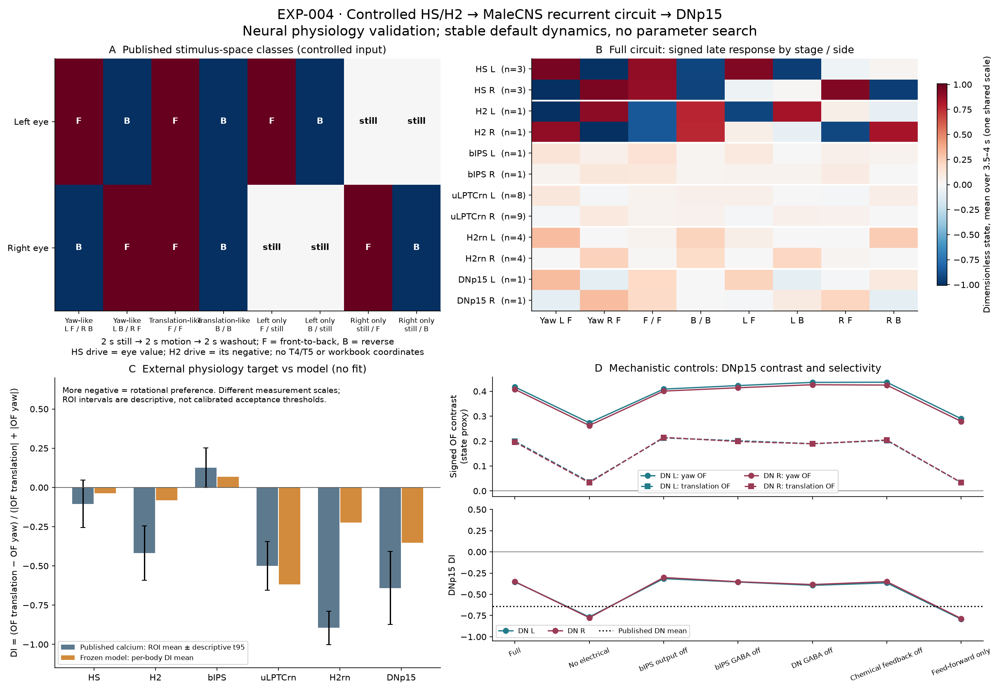

# EXP-004: controlled binocular HS/H2 physiology

## Question and result

Can a MaleCNS-constrained HS/H2 recurrent network enhance DNp15's response to
rotational/asymmetric flow while suppressing symmetric translation-like flow?

The stable default model produces **partial qualitative agreement**, but does
not reproduce the proposed recurrent enhancement. DNp15 retains a rotational
response and is less sensitive to translation than the matched upstream
representation. Nevertheless, a fixed-weight feed-forward control is more
selective than the full recurrent model. H2, H2rn and DNp15 also remain less
rotationally selective than the published calcium measurements. The biological
hypothesis remains inconclusive; the tested implementation does not establish
the experimental mechanism. No parameters were fitted or retuned.



Panels show the stimulus classes, raw model responses at each stage, the
external discrimination-index target, and DNp15 responses under controls.
Published measurements are from
[Erginkaya et al. (2025)](https://doi.org/10.1038/s41593-025-01948-9), source
data for Figure 3e. Model states are dimensionless, not membrane voltage,
fluorescence or behavior. Neither T4/T5 nor FlyGym is used.

## External physiology and comparison contract

The target comes from the paper's immobilized-female-fly, two-photon calcium
experiments, rather than its manually adjusted simulation weights. Its
[Methods and analysis code](https://github.com/ChiappeLab/Erginkaya_et_al_2025/blob/b1b59653a9758335cfff28a81d42010ea6ff082a/scripts/matlab/PaperFiguresImaging.m)
define optic-flow responses as preferred-minus-reversed contrasts over the
last 500 ms of a 2-s motion epoch. The external source tables, exact identities,
stimuli, equations, parameters and acceptance contract were fixed in the
[specification](../experiments/EXP-004-binocular-physiology/specification.json)
before the first anatomical model evaluation. Its SHA-256 is
`1dc992eb7ed695544365dfe5dcee14de2dbbc34e5b0a2c18bd4e754ac628aafb`.

The stimuli are specified in the paper's visual-stimulus space:

| Condition | Left-eye motion | Right-eye motion |
|---|---|---|
| Yaw-like L F | front-to-back | back-to-front |
| Mirrored yaw-like R F | back-to-front | front-to-back |
| Translation-like F / F | front-to-back | front-to-back |
| Reversed translation-like B / B | back-to-front | back-to-front |
| Left-only F or B | indicated order | still |
| Right-only F or B | still | indicated order |
| Zero | still | still |

These horizontal translation-like displays omit parallax and vertical flow,
as in the corresponding published bFtoB/bBtoF comparison. They are not full
three-dimensional translation, and no MaleCNS workbook axis is assigned a
physical direction. Independent trials use 2 s baseline, 2 s motion and 2 s
washout, rather than the paper's paired-motion 13-s trial. HS receives its
ipsilateral eye value (+1 F, -1 B); H2 receives the opposite value on its
dendritic eye. MaleCNS LOP postsynaptic counts verify those input eyes.
The model is not driven with a fitted binocular response term.

The declared observation transform is
`C_proxy(t) = x(t) - mean_pre_stimulus(x)`; baseline is exactly zero. A shared
unit positive gain is used at every stage. There is no fitted calcium kernel,
class gain, clipping, z-scoring or condition normalization. This is an
**uncalibrated linear late-response calcium proxy**: relative contrasts can be
compared, but absolute fluorescence, calcium kinetics and noise cannot.
Rectified transmitter emission is saved as a separate diagnostic, not
substituted for this observation transform.

The primary window is `[3500,4000)` ms, analogous to the authors' strict
`3.5 < t < 4 s` window on downsampled calcium frames. The signed index is

```text
OF = mean preferred C_proxy - mean reversed C_proxy
DI = (OF_translation - OF_yaw) / (|OF_translation| + |OF_yaw|)
```

H2 reverses the yaw contrast relative to its local HS convention. Both H2 and
H2rn use B-minus-F translation, following the authors' Figure 3e code; other
populations use F-minus-B. These are fixed analysis conventions, not dynamics
or post hoc preferred-direction choices. Every un-oriented response is saved.
Zero denominators are undefined, recorded as JSON null, never zero selectivity.

Signed DI alone cannot pass. Each DN must retain positive declared preferred
yaw activity and contrast, and reduce both `|OF_translation|/|OF_yaw|` and
common-mode/yaw magnitude relative to its matched upstream set: three
ipsilateral HS cells plus contralateral-dendritic-eye H2. Upstream pooling uses
RMS across individual units before comparison, preventing opposing signs from
cancelling. Common-mode magnitude uses the larger absolute F/F or B/B response;
the yaw reference uses the larger absolute mirrored-yaw response. DN mean
magnitude-only DI must also be more rotational than both HS and H2 populations.
Numerical comparisons use epsilon `1e-10`, not a fitted biological threshold.

Recurrent enhancement additionally requires nonzero bilateral superposition
residuals and improved DN magnitude ratios over the same-weight feed-forward
control on both sides. Descriptive ROI t95 intervals are reported, not used as
calibrated acceptance thresholds or independent-fly confidence intervals.

## Circuit identities and chemical anatomy

The induced graph contains **37 neurons and 360 directed chemical edges** from
`male-cns:v1.0`. All positive counts among the identified populations are
retained, with no synapse threshold, target-class boundary or extra traversal
hop. The specification lists all official types, instances, sides and body IDs.

| Population | Left body IDs | Right body IDs |
|---|---|---|
| HS | HSE 10034; HSN 10181; HSS 10419 | HSE 10016; HSN 10015; HSS 10023 |
| H2 | 10019 | 10025 |
| bIPS / PS321 | 11919 | 12072 |
| uLPTCrn-corresponding PS070/072/074 set | 32628, 34260, 54118, 73647, 78362, 93253, 533741, 534559 | 35185, 39912, 44944, 65132, 68944, 511817, 512038, 513339, 513340 |
| H2rn-corresponding CB3740/CB3748 set | 35103, 76787, 110619, 136904 | 34506, 39213, 41916, 94797 |
| DNp15 | 12069 | 11215 |

The paper's
[Supplementary Table 2](https://media.springernature.com/original/springer-static/esm/art%3A10.1038%2Fs41593-025-01948-9/MediaObjects/41593_2025_1948_MOESM1_ESM.pdf),
entries 21 and 23, gives bIPS hemibrain bodies 1932497911 and 1963869636.
MaleCNS identifies these homologues as `PS321(hb1932497911)_R` (12072) and
`PS321(hb1963869636)_L` (11919). Independent unrestricted input/output queries
recover 898 unique neighboring chemical pairs; all 80 pairs retained in the
induced graph match those queries exactly.

The verified motifs include HS/H2 input to bIPS, reciprocal GABAergic PS072
connectivity (PS321→PS072: 12 pairs / 287 synapses; PS072→PS321: 18 / 235),
and strong contralateral DNp15 outputs:

- 11919→11215: 158 synapses; its ipsilateral DN output has one synapse.
- 12072→12069: 127 synapses; its ipsilateral DN output has one synapse.

### Release-aware H2rn identity

All five published H2rn roots resolve without omission or connectivity-based
substitution. The
[released v1.1.0 schema](https://github.com/flyconnectome/flywire_annotations/blob/df6bb136f5b3d91c3992df4e8de2642329e2a384/supplemental_files/Supplemental_files_columns.md)
identifies its roots as FlyWire release 630. Its exact anchor-supervoxel IDs
join to the documented anchors in the
[pinned release-783 annotation table](https://github.com/flyconnectome/flywire_annotations/blob/8587524c1748ce5ef2080822a2fc890fc03bf597/supplemental_files/Supplemental_file1_neuron_annotations.tsv).

| Published release-630 root | Unchanged anchor supervoxel | Release-783 root | Released type |
|---|---|---|---|
| 720575940621865991 | 78183935993544196 | 720575940620118430 | CB3740 |
| 720575940622082451 | 78254098645935549 | 720575940622812287 | CB3740 |
| 720575940624756836 | 78254510896007186 | unchanged | CB3740 |
| 720575940617566769 | 78254716920480667 | unchanged | CB3740 |
| 720575940642076576 | 78254716986961377 | unchanged | CB3748 |

MaleCNS homologues are selected through these exact `flywireType` labels.
The uLPTCrn correspondence is only the PS070–PS074 class family explicitly
listed in the supplement; the release contains PS070, PS072 and PS074 matches.
Neither class crosswalk assigns an individual female physiological ROI to a
MaleCNS neuron. Class abundance, ROI coverage and side-label conventions differ
between datasets; unweighted male-cell averages approximate pooled female ROIs.

### Correction relative to the earlier materialization

The earlier 175-node / 609-edge bundle contains the eight HS/H2 cells and two
DNp15 cells, but none of the 27 bIPS/uLPTCrn/H2rn cells used here. Its queries
restricted downstream targets to HS/H2 and DNs after a T4-centered traversal.
Thus the missing recurrence was a **materialization boundary**, not evidence
of biological absence. That source and its numerically invalid outputs remain
preserved in the [earlier implementation record](EXP-004-preflight-failure.md).
Its non-diffusive electrical term and non-decaying recurrence are not reused.
EXP-001 through EXP-003, their corrections and frozen records remain unchanged.

Two one-synapse DNp15 chemical outputs returned by MaleCNS are also retained
(to HS and H2rn). Their functional significance is unresolved, particularly
because the primary paper describes DNp15 without brain axon terminals. The
feed-forward control excludes these alongside other feedback; no weak edge is
silently promoted to established physiology.

## Physiology, equations and parameters

**Structural facts:** body identity, directed chemical counts, official sides
and consensus transmitter predictions come from MaleCNS. HS/H2/DNp15 are
cholinergic in this selected release; the intermediates are GABAergic.

**Literature physiology:** excitatory cholinergic and inhibitory fast-GABA
interpretations are motivated by the 2025 network study. Separate electrical
pairings are supported by the Drosophila dye-coupling results in
[Pokusaeva et al. (2024), Figure 7](https://doi.org/10.1038/s41467-024-53173-w):

- HSE_L 10034 ↔ H2_R 10025; HSE_R 10016 ↔ H2_L 10019.
- HSN_L 10181 ↔ DNp15_L 12069; HSN_R 10015 ↔ DNp15_R 11215.

The specific HSE–contralateral-H2 interaction also has classic direct
[blowfly physiology](https://pubmed.ncbi.nlm.nih.gov/16964250/); it is not evidence
for generic H2-to-all-HS coupling. Dye coupling does not measure these modeled
conductances or exclude intervening electrical paths. Direct point-neuron
pairings, bilateral transfer and equal state scales are explicit assumptions.
Within-HS and HS/bIPS gaps are omitted rather than inventing all direct pair/side
combinations. Electrical pairs never enter the MaleCNS chemical edge table.

**Model assumptions and free numerical parameters:**

```text
tau * dx/dt = -x + Wchem * max(x,0) + Gdiff * x + u(t)
Wchem[i,j] = gain * sign(j) * count(j,i) / sum_k count(k,i)
gap current at i from pair (i,j) = g * (x[j] - x[i])
x[k+1] = x[k] + (dt/tau) * right_hand_side(x[k],u[k])
```

Chemical denominators use the full retained induced graph, not all inputs in
the brain, and are fixed before every ablation. Signs are +1 ACh / -1 GABA;
edge-specific receptor conductances are not measured. The presynaptic emission
is half-rectified; signed subthreshold states are retained. All nodes use the
same time constant; no tonic activity or compartment-specific gating is added.

| Free quantity | Fixed value | Basis |
|---|---:|---|
| Numerical step | 0.5 ms | verified against 0.25 ms, not fitted |
| Neural low-pass tau | 20 ms | declared default, not a measurement of these cells |
| Chemical gain | 0.5 | bounds normalized recurrent absolute mass below leak |
| Each electrical conductance / leak | 0.1 | declared default, not measured or fitted |
| Controlled input amplitude | 1 | dimensionless signed unit drive |
| Baseline / motion / washout | 2000 / 2000 / 2000 ms | motion duration follows target; trial framing is simplified |
| Observation gain | 1, common to all cells | uncalibrated linear proxy; no calcium-transfer fit |

CSR chemical and diffusive operators use explicit int64 body axes and float64
states. No condition label enters the numerical update.

## Numerical validation

Every full/control graph passes, at both time steps:

- Global Euler infinity-norm contraction bound: 0.9875 at 0.5 ms. This bounds
  every rectifier mask, not just the raw recurrent spectral radius.
- Maximum encountered effective-transition spectral radius: ≤0.977446.
- Four deterministic zero-input perturbations decay over 2000 ms;
  worst final/initial infinity-norm ratio: 3.47×10⁻⁴².
- Equal-state gap current is zero; pair exchange reverses its sign, conserved
  pair current dissipates differences, and coupling equalizes the pair.
- Every condition is repeated exactly at both numerical resolutions.
- Step halving changes raw traces by at most 0.002502 unit drive; late response
  and index discrepancy is below 1.17×10⁻¹³. The declared limits were 0.01 and
  10⁻⁶, respectively.
- All surviving ablated chemical weights remain exactly equal to their full
  values; denominators are never recomputed after removal.
- Zero-stimulus responses stay exactly zero and stimulated trials decay after
  input removal.

Independent dense reconstruction from raw counts and direct electrical pairs
matches the final sparse operator and execution. Tests also exercise shuffled
body/edge order, finite-difference Jacobians, all fixture rectifier masks,
missing/ambiguous identity failures and misleading signed-DI counterexamples.

## Neural results

| Population | Published mean signed DI | Model signed DI | Model magnitude-only DI |
|---|---:|---:|---:|
| HS | -0.1043 | -0.0365 | -0.0365 |
| H2 | -0.4186 | -0.0829 | -0.0829 |
| bIPS | +0.1264 | +0.0667 | +0.0667 |
| uLPTCrn | -0.5007 | -0.6177 | -0.4448 |
| H2rn | -0.8947 | -0.2228 | -0.2228 |
| DNp15 | -0.6409 | -0.3517 | -0.3517 |

All population mean signed preferences have the experimental sign. However,
H2, H2rn and DNp15 lie outside the descriptive source-ROI intervals. The
uLPTCrn signed/magnitude difference illustrates why signed DI alone is not a
safe suppression measurement. Intermediate translation sensitivity is visible
at bIPS, with stronger rotational selectivity at uLPTCrn; the H2rn response
does not match its very strong experimental selectivity.

The full-model DN late responses below are unnormalized signed proxies:

| Stimulus | DNp15 L 12069 | DNp15 R 11215 |
|---|---:|---:|
| Yaw L F / R B | +0.31953 | -0.09893 |
| Mirrored yaw L B / R F | -0.09781 | +0.30872 |
| F / F | +0.19757 | +0.19004 |
| B / B | -0.00201 | -0.00606 |
| Left-only F | +0.22059 | -0.01160 |
| Left-only B | -0.08786 | +0.09320 |
| Right-only F | -0.00998 | +0.21574 |
| Right-only B | +0.09912 | -0.08745 |
| Zero | 0 | 0 |

DN translation/yaw contrast ratios are 0.4782 L / 0.4811 R, compared with
matched-upstream RMS ratios 0.9125 / 0.9154. Raw common-mode/yaw ratios are
0.6183 / 0.6156 versus 0.8877 / 0.8927 upstream. Preferred yaw activity and
contrast remain positive on both sides. The bilateral-minus-sum-of-unilateral
DN residual reaches 0.01410, confirming that the complete modeled response is
not a purely linear superposition. These findings pass the limited upstream-to-
DN magnitude/polarity gate, not the mechanistic or calibrated physiology gate.

## Mechanistic controls

All controls share the same drive, parameters and full-graph survivor weights.

| Model/control | Chemical pairs disabled | Gap pairs | Mean DN yaw OF | Mean DN translation OF | Mean DN DI |
|---|---:|---:|---:|---:|---:|
| Full | 0 | 4 | 0.41250 | 0.19784 | -0.35168 |
| Electrical removed | 0 | 0 | 0.26801 | 0.03464 | -0.77117 |
| bIPS chemical output disabled | 30 | 4 | 0.40478 | 0.21388 | -0.30854 |
| GABA input to bIPS disabled | 37 | 4 | 0.41849 | 0.19999 | -0.35327 |
| GABA input to DNp15 disabled | 25 | 4 | 0.43102 | 0.18942 | -0.38937 |
| Intermediate chemical feedback removed | 244 | 4 | 0.43066 | 0.20363 | -0.35788 |
| Stage-DAG chemical feed-forward only | 258 | 0 | 0.28461 | 0.03373 | -0.78804 |

Removing bIPS output mildly reduces DN selectivity. Removing electrical
coupling markedly **improves** it while reducing yaw amplitude. Removing
intermediate chemical feedback barely changes DN selectivity; therefore it is
not required for most of this modeled preference. The feed-forward control
preserves only HS/H2→intermediate/DN and intermediate→DN paths and removes
electrical pairs. Its increased selectivity rules out attributing the full
model's readout preference to successful recurrent enhancement.

Compared with feed-forward, recurrence/electrical interactions increase full
yaw contrast by 1.44–1.46× but translation contrast by 5.80–5.93×. Both DN
magnitude-ratio mechanistic comparisons fail the predeclared contract.

The bIPS GABA-input perturbation shifts modeled bIPS DI from +0.0667 to
-0.3025. The separate published Figure 4f control cohort shifts from +0.2445
to -0.0539 after Rdl disruption: the shift direction agrees, but its baseline
and perturbed values do not. This idealized modeled receptor intervention is
not a complete genetic-manipulation reconstruction. Nor is the all-gap ablation
a ShakB experiment: the published Flp-shakB manipulation largely preserves
HS-to-descending electrical coupling, whereas this model control removes the
HSN–DNp15 pairs too. Existing controls do not isolate which gap pairing causes
the increased common-mode response.

## Limitations and conclusion

The model uses MaleCNS chemical anatomy plus literature-supported pairing
choices and freely declared numerical dynamics. It does not establish a result
from connectivity alone. Chemical count normalization, uniform kinetics,
rectification, zero tonic baseline, uncertain direct electrical paths and the
uncalibrated observation transform all remain assumptions. Source physiology
is female; anatomy is male. Intermediate classes are not individually matched
physiological neurons, and pooled ROI measurement is approximated by per-body
means. Spatial dendritic/presynaptic microcircuit gating described in the
primary study is not represented by this point-neuron aggregate graph.

Thus this implementation yields an observable binocular neural response and a
limited downstream magnitude transformation, but **does not reproduce the
experimentally motivated recurrent enhancement**. It is a stable negative
mechanistic result with partial qualitative agreement, not a falsification of
the biological network. No body work or parameter search follows it.

## Reproduction and evidence

Use the core environment and official MaleCNS annotation/transmitter files
listed in [the data manifest](../data/manifest.json). Primary source files and
all four new graph/neighborhood artifacts are hash-registered there. Raw data,
bulk traces and intermediate figures remain ignored.

```powershell
.venv\Scripts\python.exe scripts\prepare_exp004_physiology.py --download-sources --check-specification
.venv\Scripts\python.exe scripts\run_exp004_physiology.py --check-record
.venv\Scripts\python.exe -m pytest -q
.venv\Scripts\python.exe -m compileall -q src scripts tests run_experiment.py run_exp002.py
.venv\Scripts\python.exe -m pip check
.venv\Scripts\python.exe scripts\verify_local_data.py
.venv\Scripts\python.exe scripts\repository_policy_check.py
```

The [machine-readable record](../experiments/EXP-004-binocular-physiology/record.json)
contains exact results for every population, stimulus, control and preflight.
Generated outputs are `results/exp004_physiology/metrics.json`,
`neuron_responses.csv`, seven `traces_<control>.npz` files (all 37 raw state
traces, times and body axes), and `figures/EXP-004-binocular-physiology.png`.
Only the compact figure is promoted to the tracked evidence surface.

Independent complete reruns reproduce trace-array SHA-256
`7bd13c25a7e75e781272f9139cfa6b93db9b798c2c76cc176a54a4aff37f953c`.
The tested environment is recorded with the metrics; exact verification is
against that environment. The full suite has 91 passing tests, including local
final-graph independent reconstruction; that data-dependent test skips in
data-free CI. Earlier frozen record digests remain unchanged.
