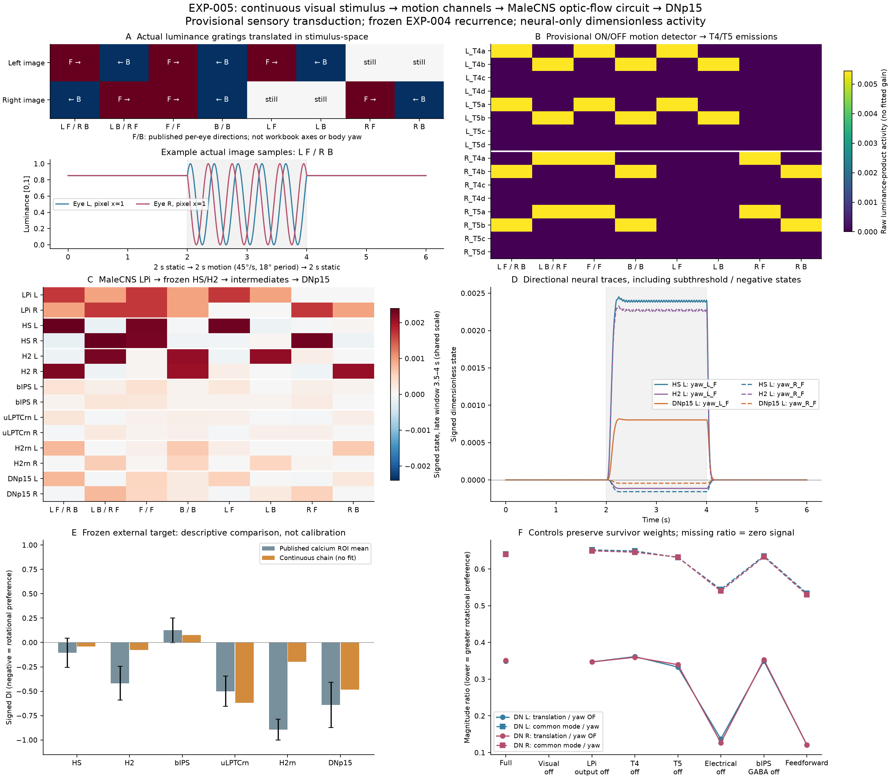

# EXP-005: continuous visual stimulus to DNp15

## Question and result

Can explicit binocular visual motion propagate through a minimal sensory approximation, identified MaleCNS visual projections, and the frozen EXP-004 central circuit into DNp15?

**Yes, with a provisional sensory interface.** Moving luminance gratings drive ON/OFF motion channels assigned to T4/T5, then MaleCNS chemical projections through horizontal LPi and HS/H2, the resolved recurrent intermediates, and both DNp15 cells. Static images produce zero activity, HS and H2 preserve their expected opposite horizontal preferences, and disconnecting the visual input abolishes descending activity. Each stage is recorded, including signed negative/subthreshold states.

This is not a reconstruction of elementary motion detection from the connectome. The limited downstream rotational-selectivity comparison passes, but the stronger recurrent-mechanism comparison does not: a fixed-weight feed-forward central control is more selective. Thus this experiment establishes an observable continuous neural chain, not validation of the published recurrent mechanism or behavior.



## Anatomy and physiological interfaces

The visual boundary was queried from `male-cns:v1.0` without a synapse-count threshold: every T4/T5 input to eight identified HS/H2 cells and six horizontal LPi cells, plus all LPi outputs within this boundary. It contains 7,556 typed, `Traced` T4/T5 bodies, six LPi cells, eight HS/H2 cells and 23,873 directed chemical edges. The union with the unchanged 37-cell/360-edge EXP-004 graph contains **7,599 bodies and 24,233 chemical edges**, plus its four separately specified electrical pairs. This is a bounded pathway, not the entire visual connectome.

| Motion type | Left bodies | Right bodies |
| --- | ---: | ---: |
| T4a / T5a | 835 / 826 | 849 / 838 |
| T4b / T5b | 844 / 863 | 846 / 852 |
| T4c / T5c | 139 / 99 | 151 / 99 |
| T4d / T5d | 91 / 61 | 108 / 55 |

Reduced vertical coverage reflects the horizontal target selection, not biological absence. The LPi cells are `LPi21` 10066 R / 11041 L, and `LPi12` 10308, 10436 R / 11709, 13310 L. All six are MaleCNS consensus GABAergic. The T4/T5–LPi–LPTC architecture is independently described by [Shinomiya et al. (2022)](https://doi.org/10.1016/j.cub.2022.06.061). Vertical LPi glutamate/GluCl conductance measurements in [Ammer et al. (2023)](https://doi.org/10.1038/s41593-023-01443-z) are **not** transferred to these horizontal cells; receptor-specific horizontal conductances remain unknown.

Every selected motion body's eye assignment was checked against its sensory dendritic ROI: medulla for T4, lobula for T5. One T5a body, **152777**, has neither lobula dendritic ROI recorded; its left lobula-plate output supports the assigned eye. It remains included and explicitly marked as output-only evidence, not a reconstructed receptive field. This supplementary anatomical check did not alter the previously declared sensory encoding or parameters.

HS inputs are HSE/HSN/HSS L 10034/10181/10419 and R 10016/10015/10023; H2 L/R are 10019/10025. Their central graph, identity crosswalk, normalization, dynamics and electrical pairs are those of [frozen EXP-004](EXP-004-binocular-physiology.md). The middle layer contains bIPS (`PS321` 11919/12072), 17 class-crosswalked uLPTCrn and eight H2rn cells; DNp15 L/R are 12069/11215. No new central edges or physiological identities are inferred.

## Stimulus and dynamics declared before evaluation

Two explicit 16×16 luminance patches span two sinusoidal periods. The inputs cover asymmetric L F/R B and its reverse, symmetric F/F and B/B, left-only and right-only F/B, and static controls. F/B refer to published per-eye horizontal stimulus directions, **not workbook indices or an inferred body rotation**. Each trial has 2 s static baseline, 2 s motion, and 2 s static washout at the final phase. There is no body simulation, parallax or behavioral controller.

Luminance is `I = 0.5 + 0.5 cos(2π(position − displacement)/18°)`, with 2.25° pixels and 45°/s translation. Wavelength, speed, contrast and patch size are fixed engineering defaults, not fitted biological measurements. These gratings are not the paper's spherical starfield; uniform flow and spatial averaging stand in for wide-field stimulation.

The motion approximation uses an adapting low-pass `a`, high-pass `h = I − a`, separate ON/OFF rectification, and delayed signals `d`. For each spatial axis and polarity:

```
50 ms da/dt = I − a
q_ON = max(h, 0); q_OFF = max(−h, 0)
15 ms dd/dt = q − d
r = mean_space(d_neighbor q_self − q_neighbor d_self)
10 ms de_positive/dt = max(r, 0) − e_positive
10 ms de_negative/dt = max(−r, 0) − e_negative
```

The 50/15-ms filter times follow the two-quadrant Reichardt approximation in [Erginkaya et al. (2025), Agent simulations](https://doi.org/10.1038/s41593-025-01948-9); its manually fitted downstream weights are not imported. T4=ON, T5=OFF and subtype a/b/c/d=front-to-back/back-to-front/up/down follow [Maisak et al. (2013)](https://doi.org/10.1038/nature12320). These assignments are external physiological constraints, not connectome-emergent selectivity. Periodic neighboring pixels and shared eye/type channel activity are explicit approximations; individual receptive-field geometry and photoreceptor/lamina/medulla dynamics are not reconstructed.

Visual chemical weights are `W[i,j] = 0.5 sign(j) count(j,i) / sum_k count(k,i)` over the full selected visual incoming graph. Acetylcholine is positive and GABA negative. LPi states obey `20 ms dl/dt = −l + W_motion e + W_LPi max(l,0)`. The eight HS/H2 projections become the only external central drive. Central states use **unchanged EXP-004**:

```
20 ms dx/dt = −x + W_central max(x,0) + G_diff x + u_visual
G_diff x: each supported pair contributes 0.1 (other − self)
```

The four electrical pairings remain HSE L↔H2 R, HSE R↔H2 L, HSN L↔DNp15 L and HSN R↔DNp15 R, with pair-specific literature provenance in the frozen specification. They are not MaleCNS chemical edges. No generic class-wide coupling is added.

All updates use pre-update samples and explicit Euler at 0.5 ms. New free defaults are the grating parameters above, 10-ms emission filter, 20-ms LPi time and 0.5 visual gain. Central parameters are unchanged: 20-ms leak, 0.5 chemical gain and 0.1 gap conductance. Neither visual nor central weights are renormalized after ablation; raw motion activity is not amplified to obtain DN responses. No fitting or parameter search occurred.

## Stage-level validation and physiological comparison

The independent tests cover static/flicker nulls, reversal, eye exchange, ON/OFF contrast inversion, vertical channels, quadratic contrast scaling, causality, scalar motion-filter reference, raw-count projection equivalence and an independent dense LPi update. Shared-channel sparse compression exactly preserves the declared per-body input assignment; it does not assert that biological T4/T5 activity is spatially uniform in general.

All final-graph controls at 0.5 and 0.25 ms pass global LPi/central effective-Euler contraction bounds, perturbed zero-input decay, determinism and timestep convergence. The cascade is feed-forward between stages; its stable recurrent blocks are checked separately, not represented as a single unweighted contraction claim. The frozen central electrical operator remains diffusive. Biological acceptance is separate from numerical validity.

At the production timestep, the maximum contraction bounds are 0.975283 for LPi and 0.9875 for the central graph. Worst 2-s final/initial perturbation ratios are below 3×10⁻⁴². The largest stage trace discrepancy after timestep halving is 0.516% of that stage's peak amplitude; the largest late DI discrepancy is 7.44×10⁻¹⁵. The full suite has 101 passing local tests, including a connected LPi-to-central perturbation-decay check; independent reruns must match the recorded trace digest and metrics.

The observation transform, 3.5–4 s window, signed contrast conventions, magnitude DI, uncancelled matched-upstream RMS comparison and recurrent-control requirement are unchanged from EXP-004. States are dimensionless activity proxies, not calibrated voltage or fluorescence. Different visual patterns and the uncalibrated calcium transform limit the external comparison to qualitative/descriptive evidence.

| Population | Model mean signed DI | Published ROI mean DI |
| --- | ---: | ---: |
| HS | −0.0414 | −0.1043 |
| H2 | −0.0779 | −0.4186 |
| bIPS | +0.0777 | +0.1264 |
| uLPTCrn | −0.6190 | −0.5007 |
| H2rn | −0.1965 | −0.8947 |
| DNp15 | −0.4819 | −0.6409 |

The largest hierarchy discrepancy is H2rn, with substantial H2 mismatch as well. The source ROI intervals and errors are preserved in the machine record; they are descriptive, not fitted acceptance thresholds or independent-fly confidence intervals.

Under ipsilateral single-eye stimulation, HS F/B means are L +0.002329/−0.000112 and R +0.002318/−0.000118; H2 F/B means are L −0.000099/+0.002116 and R −0.000100/+0.002076. The declared motion and upstream direction-preference invariants pass. However, the **first quantitative external discrepancy already occurs at H2**, whose DI lies outside its descriptive source interval; it cannot be attributed solely to later recurrence. H2rn then shows a larger mismatch, and the central causal recurrent-enhancement test fails. This distinguishes successful propagation from physiological agreement. Sensory-transduction calibration remains provisional even where its declared invariants pass.

## Controls and conclusion

| Control | DN translation/yaw contrast ratio L / R | DN common-mode/yaw magnitude ratio L / R |
| --- | ---: | ---: |
| Full | 0.349 / 0.351 | 0.641 / 0.640 |
| Visual disconnected | undefined: zero activity | undefined: zero activity |
| LPi output removed | 0.347 / 0.347 | 0.652 / 0.650 |
| T4 removed | 0.361 / 0.360 | 0.649 / 0.646 |
| T5 removed | 0.333 / 0.340 | 0.631 / 0.632 |
| Central electrical removed | 0.137 / 0.127 | 0.544 / 0.540 |
| GABA input to bIPS removed | 0.349 / 0.353 | 0.635 / 0.633 |
| Feed-forward central only | 0.121 / 0.121 | 0.534 / 0.530 |

Full DNp15 yaw contrasts are L 0.000847 / R 0.000823. Matched upstream translation/yaw ratios are 0.906/0.912 and common-mode/yaw ratios 0.846/0.843. Both DN cells preserve a positive declared rotational response and reduce both ratios relative to matched upstream, so the limited transformation gate passes. DN bilateral-superposition residual is 0.0000177, indicating nonlinearity.

However, removing electrical coupling or using a feed-forward central graph **increases**, rather than destroys, selectivity; removing bIPS GABA input does not recover the experimental causal dependence. Electrical removal is a model intervention, not the published ShakB manipulation. These controls leave the binocular recurrent-mechanism hypothesis **inconclusive**, with a negative result for this fixed implementation. They do not falsify the biology.

The continuous sensory-to-descending milestone is achieved within the stated approximation. No body, motor command, steering sign or whole-fly claim follows. Future work can now examine sensory calibration, horizontal receptor-specific weights and intermediate dynamics at identifiable boundaries without changing the frozen evidence.

## Reproduction and records

With the registered local MaleCNS and EXP-004 source files installed:

```
python scripts/prepare_exp005_sensory.py --check-specification
python scripts/run_exp005_sensory.py --check-record
python -m pytest -q
```

The [specification](../experiments/EXP-005-sensory-to-DNp15/specification.json) fixes inputs, parameters, provenance, controls and validation contracts before downstream evaluation. The [record](../experiments/EXP-005-sensory-to-DNp15/record.json) preserves per-stage responses, per-body central results, source and implementation hashes, preflights, timestep errors and a deterministic trace digest. Supplemental eye anatomy is hashed and registered separately. NPZ files include raw channel, LPi, projected HS/H2 drive, central traces, stimulus-pixel samples and body/channel axes; individual assigned T4/T5 traces can be reconstructed exactly from those axes. Bulk data and results remain ignored; only the compact figure is promoted.

EXP-001 through EXP-004, including earlier failures and EXP-004's stable negative mechanism result, remain unchanged.
