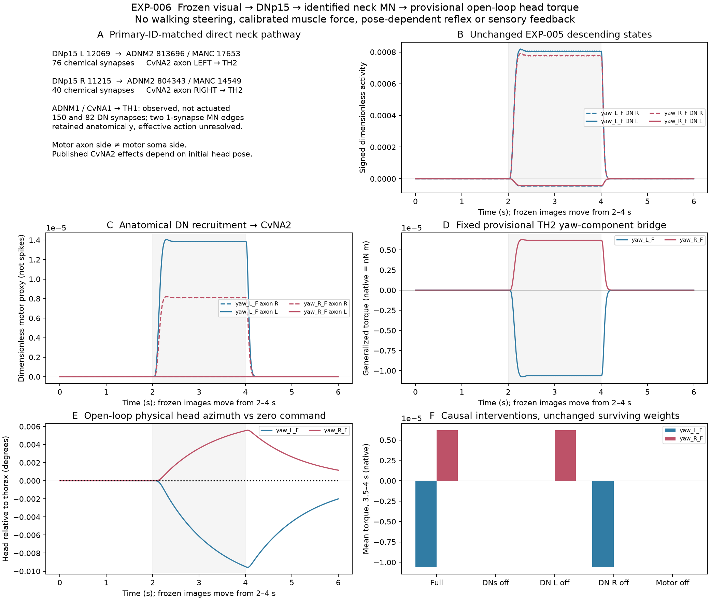

# EXP-006: DNp15 to identified neck motor output

## Question and result

Can the frozen sensory-to-DNp15 chain recruit anatomically identified neck motor
neurons and produce an interpretable open-loop physical effect?

**The implemented chain produces small, opposite-signed head-azimuth changes
through a fixed, explicitly provisional torque interface.** Disconnecting DN
output eliminates motor recruitment; disconnecting the motor interface preserves
neural recruitment but eliminates commanded torque. The disconnected physical
trajectory exactly matches the zero-command baseline.

This establishes an executable descending-to-motor boundary, not calibrated
muscle physiology, walking steering, whole-body yaw, or closed-loop behavior.
The physical sign comes from a literature-informed motor projection; it is not
an independent rediscovery of a muscle's action from connectome counts.



## Anatomy and identities

Public neuPrint queries of `male-cns:v1.0` first retrieved **all 434 direct DNp15
target edges**, without a target-type or synapse-count cutoff. Of these, 50 edges
terminate on `vnc_motor`-labeled bodies; this counts directed edges, not distinct
neurons or muscles, and is not a complete motor model.
The selected induced graph contains **six neurons and six chemical edges**:

| Presynaptic MaleCNS ID | Postsynaptic MaleCNS ID | Synapses | Anatomical target / output side |
|---|---|---:|---|
| DNp15 L 12069 | ADNM1 MN 801678 | 150 | CvNA1, CvN-left, TH1 |
| DNp15 R 11215 | ADNM1 MN 903152 | 82 | CvNA1, CvN-right, TH1 |
| DNp15 L 12069 | ADNM2 MN 813696 | 76 | CvNA2, CvN-left, TH2 |
| DNp15 R 11215 | ADNM2 MN 804343 | 40 | CvNA2, CvN-right, TH2 |
| ADNM1 MN 801678 | ADNM2 MN 813696 | 1 | Retained structurally; functional effect unmodeled |
| ADNM2 MN 804343 | ADNM1 MN 903152 | 1 | Retained structurally; functional effect unmodeled |

No intermediate is necessary for these direct connections. Unrestricted queries
also found strong DNp15 inputs to MNnm11 and FNM2 (respectively 198/151 and
53/46 synapses for L/R DN sources). Those targets are not actuated here: the
exact primary-ID crosswalk is strongest for the selected CvNA1/CvNA2 pairs,
and additional motor endpoints are unnecessary for this first boundary.

| MaleCNS body | Official `mancBodyid` | MANC v1.2.1 instance | Primary-paper identity | Muscle |
|---|---:|---|---|---|
| 801678 | 20860 | MNnm04_CvN_L | CvNA1 | TH1 |
| 903152 | 10407 | MNnm04_CvN_R | CvNA1 | TH1 |
| 813696 | 17653 | MNnm05_CvN_L | CvNA2 | TH2 |
| 804343 | 14549 | MNnm05_CvN_R | CvNA2 | TH2 |

Gorko et al.'s Supplementary Table 2 supplies those exact MANC IDs; Figure 4h
and Supplementary Figure 10d identify the muscles. Cervical output laterality is
verified from MANC's explicit nerve-side instances, **not motor soma side**,
which is opposite here. MaleCNS uses `ADNM1 MN`/`ADNM2 MN`; MANC uses
`ADNM1`/`ADNM2`, matched through official `mancType`, not guessed names.
[Primary anatomy and physiology](https://doi.org/10.1038/s41586-024-07222-5).

## Physiology and coordinate boundary

Gorko's right-axon-standardized CvNA2 measurements show a positive mean yaw
component and negative pitch component (677 trials, 11 flies, 300-ms activation).
Movement depends on initial posture. Methods standardize left-exiting axons by
reflection; Extended Data Figure 2c defines right-handed lab roll/pitch/yaw and
a body pitched 40 degrees above lab X. Positive azimuth points front-to-left.
[Gorko et al.](https://doi.org/10.1038/s41586-024-07222-5).

This experiment imports **only a yaw-component torque tendency**. It does not
import the source feedback model, recover posture-dependent recruitment, or
claim its zero-initial-pose trajectory matches a pose-conditioned biological
measurement. The mirrored left effect is a bilateral symmetry assumption,
not a separately calibrated left-muscle measurement.

The published numerical axes/speeds were not extracted. The authors' pinned
[source repository](https://bitbucket.org/stephenhuston/code_data_gorko_et_al/src/8700dc2a74d4796025938f773498ac91b48240a1/)
contains a 1,638,799,259-byte MAT file for Figure 4; bounded header requests
timed out. Figures were inspected, not digitized. No CvN7 calibration is
substituted for CvNA2. Thus **no quantitative biological kinematic fit is claimed**.

## Dynamics, assumptions and free parameters

EXP-005 sensory, visual and central dynamics are unchanged and evaluated afresh
for `yaw_L_F` and `yaw_R_F`. Their individual late DNp15 responses reproduce the
frozen record within `1e-15` absolute tolerance. F/B retain EXP-005's published
stimulus-space interpretation, not anatomical workbook axes or body turn labels.

The motor extension uses a sparse four-edge feed-forward projection:

```text
e_DN[k] = max(x_DN[k], 0)
W[m,d]  = 0.5 * MaleCNS_count[d,m] / all_source_incoming_count[m]
tau * dm/dt = -m + W e_DN
m[k+1] = exp(-dt/tau)*m[k] + (1-exp(-dt/tau))*W e_DN[k]
torque[k] = 1 native unit * cos(40 degrees)
            * (max(m_CvNA2_axon_R[k],0) - max(m_CvNA2_axon_L[k],0))
```

Samples are pre-update: input `k` affects state `k+1`, never state `k`. Initial
motor states are zero. The all-source anatomical denominators are 7,598, 6,446,
2,204 and 1,921 for 801678, 903152, 813696 and 804343 respectively. Other motor
inputs are zero, not removed from the denominator. Controls never renormalize
surviving edges.
Here "all-source" means every queried `a:Neuron` input, not every raw segment,
synapse or an estimate of total membrane conductance.

The **20-ms motor time constant, 0.5 chemical gain, 0.5-ms sampling and unit torque
coefficient were fixed before output evaluation**. They are engineering defaults,
not measured DN-to-motor physiology or fitted gains. Presynaptic DNp15 ACh is
MaleCNS consensus; treating its action on these MNs as excitation is an effective
receptor/sign assumption. All four selected MNs have unclear consensus
transmitter; no functional sign is assigned to their two weak central outputs.
CvNA1/TH1 is recorded but not used for torque. There is no tonic drive, peak
normalization, recruitment threshold, stimulus-dependent branch or behavioral
decoder. Synapse counts do not determine calibrated physiological strength.

FlyGym uses g-mm-s units: one native torque unit is `1e-9 N m` (1 nN m).
The coefficient is therefore **1 nN m per unit of dimensionless motor proxy**.
It does not establish firing rate, muscle force, moment arm or physiological
torque magnitude.

## Open-loop physical test

The optional installed **FlyGym 1.2.1 / MuJoCo 3.2.7** body is tethered, with
vision disabled and no gait/behavior controller. Frozen neural samples are
held for five 0.1-ms physical steps. The physics engine is stepped directly;
no body state feeds into neural drive or command generation.

At the native zero-orientation spawn, X is forward, Y left and Z up. The source
lab yaw axis transforms to `[sin(40), 0, cos(40)]` in body coordinates. Only its
native Z component is retained. The installed XML's `joint_Head_roll` is actually
the Z hinge: its world `xaxis` is `[0,0,1]`, and a +0.001-rad joint perturbation
produces +0.001-rad physical head azimuth. `joint_Head_yaw` instead has X axis.
This documented one-DOF reduction excludes pitch, the X projection and detailed
muscle geometry; it is not the paper's full quaternion-space movement.
TH2 is the identified biological endpoint; the simulator uses a generalized
joint motor, not a reconstructed TH2 musculotendon actuator.

Default physical stiffness/damping remain explicit: actuated hinge 0.05/0.06,
other neck stiffness 10, other joints 1/1, actuator force range +/-65, gravity
`[0,0,-9810] mm/s^2`, seed 0, zero-orientation spawn and six-second duration.
These are new test-setup defaults, not changes to historical body experiments.
Head azimuth is measured from head relative to thorax rotation matrices and
compared with a matched zero-command trajectory; it is not whole-body yaw.

| Frozen visual condition | Mean torque, 3.5–4 s (nN m) | Mean head azimuth change, 3.5–4 s | Peak absolute change | Final change at 5.9995 s |
|---|---:|---:|---:|---:|
| `yaw_L_F` | -0.0000106178 | -0.008869 degrees | 0.009574 degrees | -0.002006 degrees |
| `yaw_R_F` | +0.0000061990 | +0.005178 degrees | 0.005590 degrees | +0.001171 degrees |

Signs were **not preassigned to visual conditions**. They follow frozen DN
activity, verified nerve-output correspondence and the declared source-informed
motor projection. Different magnitudes reflect anatomical count/input-mass
asymmetry and frozen neural activity, not separate side gains.

## Controls and validation

- Full model: physical head-azimuth tendency has the sign of the delivered torque.
- Both DNs disconnected: motor state and commanded torque are exactly zero;
  the physical trajectory is exactly the zero-command baseline.
- Motor interface disconnected: motor recruitment is identical to full model;
  torque is exactly zero and therefore has the same open-loop physical input as
  the disconnected-DN test.
- DN L disconnected: the `yaw_L_F` late torque falls to numerical residue;
  `yaw_R_F` torque is unchanged. DN R disconnection gives the complementary result.
  These single-DN controls are evaluated neurally, not extra body trials.
- Independent +/-0.0001-native torque pulses over 300 ms give corresponding
  positive/negative physical azimuth changes. This validates solver sign, not
  the biological bridge calibration.
- Motor transition contraction/spectral radius is `exp(-0.5/20)=0.9753099`;
  mixed signed zero-input perturbations decay to `3.72e-44` after 2 s.
- Frozen upstream visual/central numerical preflight passes at both timesteps.
  Every motor control passes decay and surviving-weight checks at both timesteps.
- Motor half-timestep differences are at most **0.531%**; body half-timestep
  baseline-subtracted head-azimuth differences are **0.000952%**. Both are below
  the predeclared 2% bound. Repeated neural and body arrays are bitwise identical
  in the recorded environment.

## Reproduction and conclusion

Download the two primary PDFs to the ignored paths named in the specification:
[author-hosted article](https://faculty.washington.edu/tuthill/docs/gorko%202024.pdf)
and [publisher supplement](https://media.springernature.com/original/springer-static/esm/art%3A10.1038%2Fs41586-024-07222-5/MediaObjects/41586_2024_7222_MOESM1_ESM.pdf).
Prepare EXP-005/004's registered source anatomy as described in their unchanged
reports; install `requirements-exp003-flygym.txt` for this optional physical run.
No neuPrint credential is required for these public queries.

```powershell
.venv/Scripts/python.exe scripts/prepare_exp006_neck.py --check-specification
.venv/Scripts/python.exe scripts/run_exp006_neck.py --check-record
.venv/Scripts/python.exe -m pytest -q
.venv/Scripts/python.exe scripts/verify_local_data.py
```

The [frozen specification](../experiments/EXP-006-DNp15-neck-motor/specification.json)
records source/anatomy hashes, pair-specific correspondence, exclusions,
parameters, coordinate assumptions and checks. The
[record](../experiments/EXP-006-DNp15-neck-motor/record.json) preserves all
responses, preflight, controls, convergence and the deterministic trace digest.
Bulk arrays/PDFs/downloads remain ignored; only the selected figure is promoted.
Verification completed with 124 passing tests, successful full-record
reproduction, compile/dependency checks, 74 registered files and 24 graph
contracts verified, tracked-tree checks and clean staged/history secret scans.

**Supported boundary:** mapped DNp15 chemical recruitment of identified neck MNs,
with literature-supported muscle identity and a provisional physical torque test.
**Unresolved boundary:** calibrated visual recruitment, per-muscle force, reflex
feedback, posture-dependent action and a quantitative CvNA2 movement target.
The biological motor boundary is not validated cleanly enough for sensory-loop
closure. All EXP-005 limitations remain in force; this extension does not turn
its partial central physiology agreement into a stronger biological result.
