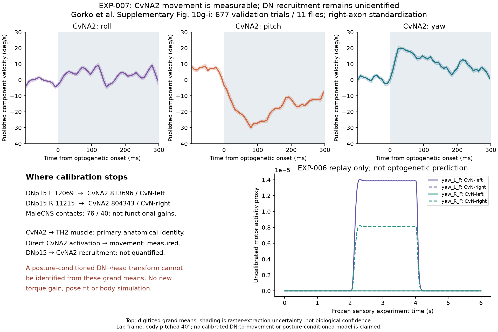

# EXP-007: CvNA2 movement target and motor-calibration boundary

## Question and result

Can primary physiology replace or quantitatively constrain EXP-006's provisional
DNp15 → CvNA1/CvNA2 → head-torque interface?

**CvNA2-specific movement is now quantified, but physiological DN recruitment
and a posture-conditioned motor transform remain unidentified.** The result is
a precise calibration boundary, not a new body model or a failure of the biology.
EXP-001 through EXP-006, including EXP-006's gains and physical results, are
unchanged. Only saved EXP-006 DN activity is replayed; upstream science and body
simulation are not rerun.



## Anatomy and recruitment evidence

The frozen six-node/six-edge induced MaleCNS graph and official MANC crosswalk
are retained. Cervical-output side comes from the MANC nerve instance, **not
soma side**. The paper correspondence is from
[Gorko et al., Supplementary Table 2 and Figure 4h](https://doi.org/10.1038/s41586-024-07222-5).

| DNp15 | MaleCNS MN | MANC body / instance | Identity / muscle | Axon output | MN soma | Synapses |
|---|---:|---|---|---|---|---:|
| L 12069 | 801678 | 20860 / MNnm04_CvN_L | CvNA1 / TH1 | L | R | 150 |
| R 11215 | 903152 | 10407 / MNnm04_CvN_R | CvNA1 / TH1 | R | L | 82 |
| L 12069 | 813696 | 17653 / MNnm05_CvN_L | CvNA2 / TH2 | L | R | 76 |
| R 11215 | 804343 | 14549 / MNnm05_CvN_R | CvNA2 / TH2 | R | L | 40 |

The two one-synapse motor-source edges remain anatomical observations with no
assigned functional action: 801678→813696 and 804343→903152.

DNp15 has predicted cholinergic transmission in MaleCNS. That is not a
postsynaptic receptor measurement or a demonstration that these particular
contacts recruit spikes. Counts identify contacts, not functional gain. In
particular, 76 versus 40 synapses does **not** establish an approximately 2:1
physiological recruitment ratio. No positive lower bound, finite upper bound,
recruitment threshold, cell-specific time constant, delay, or state-dependent
sign can be estimated from the available pair-specific evidence.

The bounded primary-source investigation distinguishes these measurements:

- [Suver et al. 2016](https://doi.org/10.1523/JNEUROSCI.2277-16.2016)
  measured DNHS1 visual responses and described putative neck/haltere terminal
  regions. Head-yaw tuning similarity was a correlation, not an identified
  DNHS1→CvNA transfer measurement. Their frontal-neck dye-coupling observation
  involved DNOVS1; it cannot be transferred to DNHS1/CvNA.
- [Erginkaya et al. 2025](https://doi.org/10.1038/s41593-025-01948-9)
  supports DNp15=DNHS1 and central optic-flow physiology, not CvNA recruitment
  calibration.
- [Gorko et al. 2024](https://doi.org/10.1038/s41586-024-07222-5)
  directly activated identified CvNA2 and measured movement. Optogenetic
  firing-rate calibration and visual motor-neuron recordings were for CvN7,
  not CvNA2 or the DNp15→CvNA connection.
- [Huston and Krapp 2009](https://doi.org/10.1523/JNEUROSCI.2915-09.2009)
  demonstrates context-dependent visual/haltere integration in **Calliphora
  vicina** neck neurons. Neither those identities nor their numerical responses
  are substituted for Drosophila CvNA1/CvNA2.

No identified-pair recruitment measurement was located in these sources or the
targeted searches. This is a statement about the evidence examined, not proof
that such measurements cannot exist.

## Quantitative CvNA2 movement target

The primary source is **Supplementary Figure 10g-i**, with the common caption on
supplement page 22. It shows **677 validation trials from 11 flies**, not 677
independent animals or the full training-plus-validation dataset. Thin grey
curves are per-fly trial means; the thick black curve is caption-described as
the grand mean of flies. Its exact weighting implementation was not recovered.

The experiment used 300-ms unilateral CsChrimson activation in tethered flying,
norpA-blind flies, imaged at 125 fps. Protocol: 625 nm, 0.37 mW/mm², 120 flashes
spaced 1.5 s apart. Left-axon data were reflected to right-axon standardization.
Movements are in the paper's right-handed laboratory frame with the body
pitched 40° upward. These are not directly the native simulator coordinates.

The caption describes ZYX Euler-angle time series, whereas the panel axes
explicitly label **angular velocity in degrees/s**. Measurements here follow
those axes. The separate 3D action fields use axis-angle/quaternion-space
coordinates, not Euler angles; they are not numerically interchangeable.

| Component | Absolute mean (°/s) | Baseline-subtracted mean (°/s) | Extraction envelope for subtracted mean | Absolute component integral (°) | Subtracted component integral (°) |
|---|---:|---:|---|---:|---:|
| Roll | +3.29 | +3.89 | [+1.45, +6.29] | +1.01 | +1.19 |
| Pitch | −17.45 | −24.06 | [−26.79, −21.23] | −5.26 | −7.22 |
| Yaw | +10.58 | +10.11 | [+7.34, +12.79] | +3.21 | +3.07 |

Response window: **0–296 ms**; baseline: **−80 through −8 ms**. Integrals use
trapezoidal quadrature; means are arithmetic means of the 38 response samples.
They are integrals of published component rates, not a
total 3D rotation, torque, muscle force, or calibrated DN-driven displacement.
Baseline subtraction is this experiment's declared observation transform, not
the authors' pose-conditioned control subtraction used in action-field insets.

The sampled yaw extreme is **+19.98°/s at 32 ms**; pitch is **−29.92°/s at 80 ms**.
These are grand-mean extrema, not synaptic or recruitment latencies. Frame
spacing plus one-pixel axis error is 9.29 ms, **not a timing confidence interval**.
Conservative line envelopes leave extremum samples compatible over 16–72 ms
for yaw and 64–128 ms for pitch. The record preserves all compatible sample
times, including non-contiguous candidates for roll.

### Extraction and uncertainty

The authors' pinned repository is
[`8700dc2a74d4796025938f773498ac91b48240a1`](https://bitbucket.org/stephenhuston/code_data_gorko_et_al/src/8700dc2a74d4796025938f773498ac91b48240a1/).
Its main-Figure-4 code identifies CvNA2 as neuron 15. The accompanying MAT file
is 1,638,799,259 bytes; bounded API/raw header and metadata requests timed out.
No MAT data or CvNA2-specific fitted coefficients were recovered. Supplement
generation code was not identified; main-Figure-4 smoothing is not assumed for
the supplement curves. No CvN7 calibration or coefficients were substituted.

Instead, the native **1209×511 RGB /Im6 bitmap** was losslessly extracted from
the frozen source PDF, without rendering/resampling. Tick positions set affine
pixel-to-unit calibration. A unique dark stroke at least three pixels thick
identifies the black mean, rejecting thin ticks and grey animal curves. Missing
or ambiguous strokes stop extraction. No smoothing or gap filling is applied.
Samples are interpolated to the source's 8-ms frame spacing.

Envelopes include stroke half-width, one-pixel coordinate calibration error,
horizontal displacement, and threshold sensitivity at 48/64/80. Threshold choice
changes extracted centers by at most **0.16°/s**. These are conservative
**digitization envelopes only**, not SEM, biological confidence intervals or
recovered raw-trial uncertainty. Fly/trial variability, starting poses and
individual identities cannot be recovered from crossing mean curves. A local
native-pixel overlay verifies that extracted samples track the black means.
Two geometric extraction corrections (tick rejection and steep-stroke width)
are recorded in the specification; model parameters and target checks did not
change.

## Why a replacement bridge is not identified

Even granting a known posture-dependent movement operator `K_pose`, optogenetic
data constrain `q_LED = K_pose * b_LED * u_LED`, while DN-driven movement would
require `q_DN = K_pose * a_DN * x_DN`. The independent recruitment factor `a_DN`
is not observed by activating the motor neuron directly. Algebraic examples
with `a_DN = 0, 1, 10` give identical LED observations and different DN effects.
These coefficients are illustrative arbitrary units, **not biological bounds,
fitted parameters or alternative simulated bridges**.

The authors' movement model additionally requires CvNA2-specific direction,
LED filter and pose/velocity feedback coefficients, with a yaw-conditioned
pitch term. Their LED gain is fitted per fly to training data to account for
expression differences, followed by held-out trial validation. Neither the
coefficients nor raw starting-pose trials were extracted here. Population mean
curves and a perspective action-field figure cannot identify that transform.

Thus published data constrain a positive right-axon **population-mean yaw
tendency**, a substantial negative pitch component, time-varying movement,
and dependence on initial pose. They do not support a universal fixed-sign,
fixed-gain torque law or a CvNA2-spike→torque calibration. EXP-006's azimuth-only
hinge cannot represent the full published 3D action field. Its verified physical
Z hinge is still `joint_Head_roll`; the XML's `joint_Head_yaw` is physical X.
No joint, body parameter, gain or coordinate convention is changed here.

## Checks and controls

Acceptance checks were specified before extraction summaries or bridge
evaluation: correct cervical output, causal DN dependence, the CvNA2 tendency,
determinism and timestep robustness are necessary but insufficient for
quantitative calibration. The calibration evidence gate stays closed.

- The source tendency check passes with yaw/pitch envelopes excluding zero.
- All five EXP-006 motor controls replay **exactly** from saved DN traces.
- DN disconnection gives zero motor activity and torque. Side disconnections
  preserve the recorded opposite-side responses; motor disconnection preserves
  recruitment but removes commanded torque.
- Identical held-input timestep halving differs by at most **1.24×10⁻¹⁵ relative**.
  This isolates numerical update accuracy; it is not a test of unknown biological
  sampling or fitted kinetics. All repeats are deterministic.
- Every frozen motor control passes contraction/zero-input decay preflight:
  0.975309912 per 0.5-ms step and 3.72×10⁻⁴⁴ after 2 s.
- Synthetic raster tests independently verify units, tick/grey rejection,
  ambiguity/missing-data failure, baseline transformation, integration and
  uncertainty semantics. Frozen source/record hashes protect prior evidence.

No new body run or quantitative physiological model comparison is justified.
These checks verify extraction and frozen execution, not physiological strength.
No free biological parameters are added. EXP-006's 20-ms motor time constant,
0.5 chemical gain and 1 nN·m/activity torque coefficient remain assumptions,
not estimates from these measurements. New numerical settings concern raster
extraction and observation windows only.

Local verification: **142 tests passed** (including 18 new tests), dependency
consistency and compilation passed, and all **75 registered files / 24 graph
contracts** were verified. A separate output-directory run reproduced the
machine record, digitized target and both figures byte-for-byte. Optional
source-data tests are skipped on installations without the ignored inputs.

## Reproduction and next evidence

The [specification](../experiments/EXP-007-CvNA2-motor-boundary/specification.json)
freezes sources, axes, windows, uncertainty, scope and the calibration contract;
the [record](../experiments/EXP-007-CvNA2-motor-boundary/record.json) stores
measurements, identities, controls, hashes and the unresolved gate.

With the registered EXP-006 anatomy, primary PDFs and saved stage arrays installed:

```powershell
# Optional only for native PDF export; use an interpreter with pypdf==6.10.0.
python scripts/prepare_exp007_target.py
.venv/Scripts/python.exe scripts/run_exp007_boundary.py --check-record
.venv/Scripts/python.exe -m pytest -q
```

Only the selected figure and compact record are committed. Native source raster,
digitized curves, overlay and generated metrics remain ignored. Core tests do
not require pypdf or installed source data; source/replay tests run when present.

**Minimum next evidence:** obtain the authors' CvNA2-only trial/fit subset with
initial quaternions, fly IDs and train/validation assignments; independently
measure identified DNp15→CvNA1/CvNA2 recruitment with controlled posture/state
and simultaneous motor voltage/spikes; obtain CvNA2-specific activation/firing
calibration. The source subset can resolve the posture/movement side, but cannot
by itself resolve the DN recruitment side. Until then retain EXP-006's explicit
uncalibrated interface and do not claim calibrated head control or closed loop.
