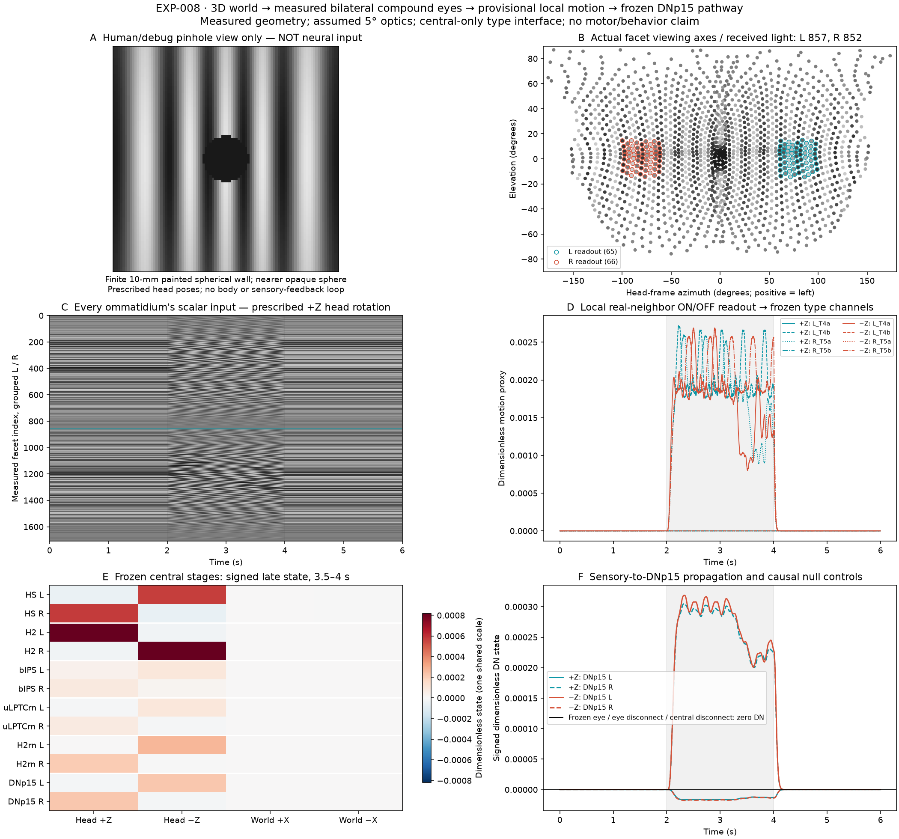

# EXP-008: a measured compound-eye boundary for a 3D world

## Question

Can defined 3D scenes generate bilateral compound-eye intensity signals that
propagate into the frozen EXP-005 visual-to-DNp15 pathway, without providing the
neural model a camera image, optic-flow field or requested motion direction?

**The controlled sensory chain propagates successfully within the stated
optical and early-vision approximations.** Both measured eyes generate scalar
facet signals, local ON/OFF correlators drive the unchanged MaleCNS visual and
central projections, and both DNp15 cells respond. This is a sensory-interface
milestone, not validation of complete eye physiology or binocular recurrence.



## Eye anatomy and optics

The geometry comes from [Zhao et al. (2025), *Eye structure shapes neuron function
in Drosophila motion vision*](https://doi.org/10.1038/s41586-025-09276-5), using the
authors' [pinned data and processing description](https://github.com/reiserlab/eyemap_T4/tree/99d2a43123db636cedb55af9ff31a59657e7d17e).
Specimen `20240701` contains **857 left and 852 right facets**. Both eyes' lens
positions, local hex-grid addresses and neighbors are retained. Viewing axes are
the authors' normalized, smoothed **lens-minus-photoreceptor-tip vectors**, not
normals of a synthetic sphere or lens surface. Cone-order vectors are permuted
into lens order using the source's one-based matching permutation. Extraction
independently checks lens/tip vectors and every recorded neighborhood arc
distance. Source positions explicitly use micrometres, converted to millimetres.

These are processed measurements from a female microCT specimen, not the
MaleCNS individual. There is **no individual facet-to-MaleCNS photoreceptor or
column crosswalk**. The eye's structural asymmetries remain intact; measured eyes
are not replaced by mirrored copies. The aligned frame is +X anterior, +Y left,
+Z dorsal. Our displayed azimuth is positive toward +Y; it should not be
confused with the paper's inside-out 2D plotting convention.

Each facet collects a normalized spherical Gaussian radiance integral:

```text
I_i(t) = sum_q w_q L(o_i(t), d_iq(t)),   sum_q w_q = 1
w(theta) proportional to sin(theta) exp(-theta² / (2 sigma²))
FWHM = 5 degrees; sigma = FWHM / sqrt(8 ln 2); cutoff = 3 sigma
o_i = translation + rotation * measured_lens_i
d_iq = rotation * angular_sample_around_measured_viewing_axis_i
```

The Gaussian and 5° acceptance default are informed by
[Reiser and Dickinson (2013), simulation methods](https://doi.org/10.1242/jeb.074732).
They are **optical assumptions, not measured facet-specific MaleCNS response
functions**. Production quadrature uses five radial Gauss–Legendre nodes and
24 azimuthal samples. A finer 9×64 rule checks baseline, intermediate and final
poses. Truncation and normalization omit the small kernel tail rather than
claiming to recover full receptor optics.

The receptor output is an instantaneous, linear, achromatic, dimensionless
light proxy. Spectral sensitivity, R1–R6 neural superposition, R7/R8 channels,
photon noise, light-dependent receptor kinetics, retinal motion, and anatomical
head self-occlusion are not reconstructed. External scene occlusion is modeled.
Only the acceptance directions and lens positions constrain the sensor field
of view; no synthetic rectangular eye mask is imposed.

## World and replaceable early-vision interface

The world is a finite 10-mm-radius spherical wall painted with 20 longitude
stripe cycles, tapering at the poles: `L = 0.5 + 0.4 (r_xy / 10) cos(20 azimuth)`.
A nearer opaque sphere at `(4,0,0)` mm, radius 0.8 mm, radiance 0.1, occludes
wall rays by nearest-positive-intersection distance. These are rendering
defaults, not biological measurements. No RGB frame, depth map, object identity
or flow field is delivered to the neural transform. The pinhole camera in the
figure is **observer-only**, called after neural evaluation.

Conditions are a static head, prescribed physical Z rotations at ±45°/s and
world X translations at ±1 mm/s. Every trial has 2 s baseline, 2 s pose change
and 2 s hold at the final pose. Labels describe the prescribed physical pose,
not workbook-column directions or simulated behavior. Sensor sampling is 2 ms;
causal zero-order hold feeds the 0.5-ms frozen numerical pathway. There is no
movement feedback or motor simulation.

The primary eye study shows that peripheral T4 preferred directions are not
globally cardinal. EXP-005's 16 shared eye/type channels cannot represent those
fields or individual receptive-field geometry. Therefore **all 1,709 facets are
sampled and saved, but only 65 left and 66 right central-lateral neighborhoods
are read out**: absolute azimuth 60–100°, elevation ±15°, complete real-grid
neighbors. Peripheral facets are not projected onto global horizontal/vertical
channels. This limited aperture is not biological wide-field integration.

Two adjacent oblique neighbors correlate with their center to approximate a
local horizontal axis; an adjacent ventral neighbor correlates with its center
for the vertical axis. Measured geometry orients the endpoints. Facet-specific
adaptation precedes ON/OFF rectification; delayed products are then pooled:

```text
50 ms da/dt = I - a
q_ON = max(I-a,0); q_OFF = max(a-I,0)
15 ms dd/dt = q - d
r_axis = mean_pairs(d_neighbor q_center - q_neighbor d_center)
10 ms de_±/dt = max(±r_axis,0) - e_±
```

Filter defaults are inherited from EXP-005. The central a/b = rearward/frontward,
c/d = dorsal/ventral approximation and T4=ON/T5=OFF follow
[Maisak et al. (2013)](https://doi.org/10.1038/nature12320), not an inferred
peripheral direction map. Neither T4 nor T5 peripheral fields are reconstructed
here. Assigning these local population signals to the frozen selected bodies
remains an explicit, replaceable approximation; no new photoreceptor/lamina/
medulla chemical circuit or neuron identity is fabricated.

An initial diametric-flank design was rejected because its measured 8.08–10.23°
span straddles half the 18° stripe period, risking spatial aliasing. The final
design uses adjacent neighbor–center pairs as in the primary correlator model.
The specification preserves that geometric correction and initial contract
hash. No DNp15 response was used to choose it; stimulus and downstream parameters
were not adjusted.

The resulting channels feed **unchanged EXP-005** T4/T5-to-LPi/HS/H2 chemical
projections and the frozen EXP-004 central network. Their union remains 7,599
identified bodies and 24,233 chemical edges, plus four separately sourced
electrical pairs. EXP-006 and EXP-007 are not run or modified. All relevant frozen
specifications, records and numerical-module hashes are checked before execution.
EXP-005's image generator and pixel-grid fields are not used. Source fingerprints
normalize LF/CRLF only for Python text; scientific data and frozen JSON records
retain exact-byte hashes. The EXP-008 specification is written with explicit LF
newlines so its exact hash is stable across Git checkouts.

## Results and controls

The machine record reports per-facet light range/change, every motion channel,
signed per-body central responses, numerical/geometry preflight, timestep
comparisons and deterministic trace digests. Stage-level success is separate
from calcium agreement or a recurrent-mechanism claim.

At the central-lateral readout, +Z head rotation preferentially drives left b /
right a channels; −Z reverses that pattern. +X translation drives a channels
on both eyes and −X drives b. These responses follow sampled intensities and
the declared adjacent-pair physiology approximation; no requested direction
enters the motion kernel or central simulation. All four moving-pose conditions
drive both eyes' ON and OFF channels, every HS/H2 projected input and every
central population. Static scenes produce exactly zero neural activity.

| Prescribed head pose | DNp15 L 12069 late mean | DNp15 R 11215 late mean |
|---|---:|---:|
| Static | 0 | 0 |
| +Z rotation, 45°/s | −0.0000128515 | +0.0002176642 |
| −Z rotation, 45°/s | +0.0002223969 | −0.0000131065 |
| +X translation, 1 mm/s | +0.0000006710 | +0.0000006609 |
| −X translation, 1 mm/s | +0.0000002531 | +0.0000002503 |

Values are **signed dimensionless states**, averaged over 3.5–4 s, not voltage,
fluorescence or calibrated recruitment. Rotation and translation are **not
matched for angular speed or motion energy**. Their magnitude difference is not
a test of DNp15 yaw selectivity, and is not compared to EXP-004's external calcium
target as though these were the same stimuli. Frozen central mechanism failures
are not revisited or corrected by this sensory result.

The three causal controls freeze the eye at its initial pose, disconnect
eye-to-motion output, or disconnect visual-to-central input. Each produces zero
descending activity. Central disconnection retains the full visual computation;
no weights, optical parameters or stimulus settings are renormalized/tuned.

Geometry checks preserve measured asymmetry: reflected nearest-axis distance
has median **1.84°**, 95th percentile **2.83°**, without enforcing pointwise eye
symmetry. Near the equator (elevation ±5°), left azimuth spans −6.27 to +149.80°
and right −151.26 to +4.65°. Measured elevations extend below −74° and above +86°.
This describes sampled directions, not a rectangular physiological field mask.
Occlusion, rigid-pose transformation, constant-radiance conservation, reflection,
static determinism and causal prefixes pass independent tests.

The 120-ray production acceptance rule differs from the finer reference by at
most **0.02978** on the normalized light scale over nine checked poses, below
the predeclared 0.05 engineering tolerance. Sensory 2→1-ms refinement changes
raw light by at most **0.02743** and any recorded neural stage by **1.7424%**.
Neural 0.5→0.25-ms refinement changes a stage by at most **0.5359%**; both stage
errors are below the predeclared 5% tolerance. These are resolution checks, not
measurement uncertainty or optical calibration.

At production dt, LPi and central global effective-Euler contraction bounds
are **0.975283** and **0.9875**; at half dt they are **0.987641** and **0.99375**.
Their perturbed zero-input decay and effective-transition checks pass. All
controls keep these same recurrent operators. Sensory low-pass coefficients are
convex, light and ON/OFF states stay bounded, and independent filter tests verify
washout. Execution repeats are deterministic; the record distinguishes numerical
validity from the uncalibrated biological interfaces.

Two independent world-sampling runs have identical production-stage and refined
sensor digests. A verification-only replay recomputes every neural stage from
the saved scalar inputs and exactly matches the machine record. The full local
suite passes **169 tests**; source compilation, dependency consistency and local
data verification also pass (82 registered files, 24 graph contracts). RData
extraction emits two class-constructor warnings; its underlying arrays pass the
independent permutation, direction and neighborhood checks.

## Reproduction and evidence boundary

```powershell
# Optional only for primary RData extraction; runtime uses NumPy/SciPy.
.venv/Scripts/python.exe -m pip install -r requirements-exp008-eye.txt
.venv/Scripts/python.exe scripts/prepare_exp008_eye.py --download --freeze-specification
.venv/Scripts/python.exe scripts/run_exp008_eye.py --check-record
.venv/Scripts/python.exe -m pytest -q
```

EXP-005/004's registered local anatomy is also required, as documented in their
unchanged reports. The [specification](../experiments/EXP-008-compound-eye/specification.json)
separates measured geometry, physiology-informed defaults, rendering and
early-vision assumptions. The [record](../experiments/EXP-008-compound-eye/record.json)
stores source/implementation hashes and stage comparisons. Per-condition NPZs
contain all sensor light samples, sensor/neural time axes, 16 channel traces,
LPi states, HS/H2 projected drive and all central states/body IDs. `sensor_axes.npz`
contains lens positions, viewing directions, neighborhoods, grid addresses and
the exact readout aperture. Fine-sampling signals are saved alongside them.
After a recorded run, `--check-record --replay-sensors results/exp008_eye_final`
can recompute neural stages from the saved scalar-facet bundle without rerendering
the entire world. Replay reads no saved neural outputs, validates sensor axes and
is verification-only; it cannot create a new experiment record. Record equality
checks both production trace digests and finer-sensor input digests. It is not a
substitute for the original ray-sampled world execution.

Primary arrays, R descriptions, local geometry and bulk results remain ignored.
The author repository is GPL-3.0; no author R implementation is copied into CNS.
The separately published raw microCT data have
[CC BY 4.0 terms](https://doi.org/10.25378/janelia.29111339.v1); those terms are not
silently substituted for the repository's processed-array terms. Only original
implementation, compact provenance/results and one derived figure are promoted.

This sensory milestone does not calibrate photoreceptor voltage, recover
full-eye MaleCNS retinotopy, resolve EXP-004/005's central physiological
discrepancies, validate the recurrent binocular mechanism, or establish motor
calibration, behavior or a whole-fly simulation. Those frozen limitations remain.
