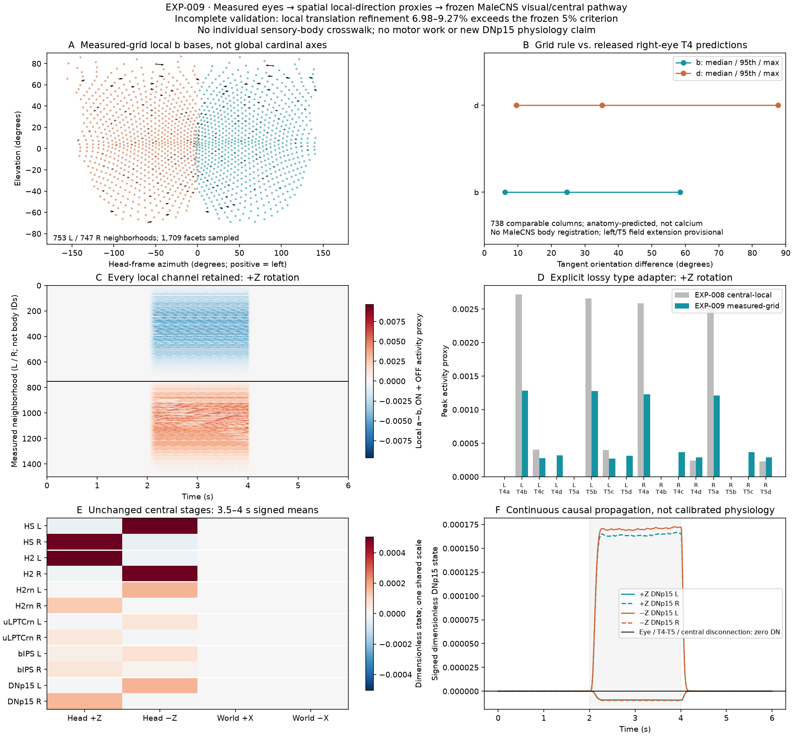

# EXP-009: broader measured-grid motion input

## Question and result

Can spatially explicit local direction signals replace EXP-008's central-local
aperture while preserving its continuous sensory-to-descending pathway?

**A broader causal representation was constructed, but its local numerical
validation is incomplete.** All 1,709 measured facets contribute to 1,500 complete
neighborhoods. Their ON/OFF direction responses remain individually observable
before a provisional adapter feeds the unchanged MaleCNS pathway to both DNp15
cells. Translation-driven local responses fail the predeclared 5% sensory-step
refinement tolerance. Neither propagation nor downstream pooling conceals or
rescues that failure. No model parameter or acceptance threshold was adjusted.



## Anatomy, direction fields and registration

[Zhao et al. (2025)](https://doi.org/10.1038/s41586-025-09276-5) relate local T4
tuning to the compound eye's nonuniform sampling and register female FAFB medulla
columns to a separate microCT eye. Their
[pinned source registration](https://github.com/reiserlab/eyemap_T4/blob/99d2a43123db636cedb55af9ff31a59657e7d17e/proc_eyemap.R)
and released arrays establish **778 literal right-lens/Mi1-column pairs**.
EXP-009 independently checks every registered viewing axis, unique index,
medulla/lens hex address and field row identifier. Source traversal order is not
assumed to be numerical index order. The registered grid differs from EXP-008's
eye-grid address origin by exactly `(1,0)`; this is an address translation,
not a fitted physical rotation. The measured +X anterior, +Y left, +Z dorsal
frame and the paper's optic-chiasm convention are retained.

The source's [T4 field construction](https://github.com/reiserlab/eyemap_T4/blob/99d2a43123db636cedb55af9ff31a59657e7d17e/proc_T4.R)
provides anatomy-predicted right-eye directions, including antiparallel a/b and
c/d extensions. These are not full-eye functional T4 measurements. The paper's
Fig. 4C and Extended Data Fig. 7 motivate local `+h` for b and `−v` for d.
EXP-009 uses these measured-grid axes on both eyes rather than globally cardinal
azimuth/elevation axes. Applying that rule to the left eye and T5 is explicitly
provisional; neither individual left-eye nor peripheral T5 physiology is supplied
by this comparison. Central ON/T4 and OFF/T5 constraints follow
[Maisak et al. (2013)](https://doi.org/10.1038/nature12320).
Nine complete right-eye neighborhoods and all 753 left-eye neighborhoods have
no FAFB-column pairing in that released registration; their local grid signals
are an extension of the measured-eye rule, not additional registered EM columns.

There is **no defended individual MaleCNS sensory-body registration** here.
Independent inspection of the pinned v1.0 annotation table finds 13,580 T4/T5
records and zero populated `assignedOlHex1/2` entries among them. The available
optic-column workbook contains 892 right-eye L1/R7/R8 rows, not T4/T5 addresses.
Its scope is narrower than the supplemental repository's general bilateral
[description](https://github.com/flyconnectome/2025malecns#optic-lobe-column-assignment).
This absence in the inspected products is not a claim that biological retinotopy
is absent or cannot be recovered from additional source anatomy.

Photoreceptor retinotopy cannot be implemented as one lens equals one R1–R6
neuron: neural superposition combines shared visual axes across ommatidia
([Langen et al., 2015](https://doi.org/10.1016/j.cell.2015.05.055)). The
[known ON/OFF circuit anatomy](https://doi.org/10.7554/eLife.24394) does not supply
the missing specimen registration or uniquely specify those sensory dynamics.
No photoreceptor, lamina or medulla body or chemical edge is fabricated.

## Model and explicit approximation boundary

The experiment starts at public baseline `af2cb05`. Frozen EXP-008 world samples
are replayed as **scalar light only**, with original trace digests, axes and
refined-sensor hashes checked. Independent ray sampling at baseline, moving and
final poses verifies the saved inputs for every condition. The scene, measured
857 L / 852 R geometry, assumed 5° optics, prescribed ±Z rotations/±X translations
and 2–4 s pose-change window are unchanged. No human camera, RGB image, object
identity, optic-flow field or requested motion direction enters the neural kernel.

Every complete measured six-neighbor neighborhood participates: **753 L / 747 R**,
versus 65 L / 66 R in EXP-008. The 209 omitted *centers* have incomplete boundary
neighborhoods; all their facets still participate as real neighbors. There is no
mirroring, synthetic padding, seam wrapping or output-selected aperture.

For unit viewing axis `u`, let `P_u(v)=v−(v·u)u`, normalized after projection.
With zero-based primary neighbor slots:

```text
b basis = unit(P_u(mean(u_2,u_3) − mean(u_0,u_5)))
d basis = unit(P_u(u_4 − u_1));  a = −b;  c = −d
```

Measured shearing, left/right differences and nonorthogonality are preserved.
The local numerical approximation uses all six adjacent neighbor–center pairs:

```text
50 ms da/dt = I − a                      a(0) = I(0)
q = (max(I−a,0), max(a−I,0))             ON / OFF
15 ms dd/dt = q − d                      d(0) = 0
C_j = d_neighbor_j q_center − q_neighbor_j d_center
r_b = (C_0 + C_5 − C_2 − C_3)/4
r_d = (C_1 − C_4)/2
10 ms de/dt = max((−r_b,+r_b,−r_d,+r_d),0) − e
```

These are local motion **proxies**, not reconstructed T4/T5 membrane dynamics.
The six-arm symmetric stencil, equal arm weights and use of facet-axis light as
a retinotopic visual-axis proxy are modeling assumptions. The 50/15/10-ms filters
are inherited unchanged from EXP-005/008, not fitted to DNp15. Explicit Euler
uses 0.5 ms; sensor samples are causally held. All states are float64. Local
emissions are saved at exactly coincident 2-ms times, while pooled channels and
downstream states are retained at every 0.5-ms step. No value interpolation is
used.

**The spatial/body mismatch remains visible.** An equal-neighborhood mean within
each eye, ON/OFF branch and local a/b/c/d class feeds EXP-005's 16 shared channels.
Rectification and emission occur *before* pooling, unlike EXP-008's pooled
opponent products. All local direction bases and emissions are retained; opposing
local activity is not canceled before recording. Nevertheless, this adapter is
lossy and does not reproduce individual MaleCNS T4/T5 receptive fields or actual
wide-field spatial weighting. It is not a hidden retinotopic body assignment.

The downstream union remains **7,599 identified bodies / 24,233 chemical edges**
and four separately sourced electrical pairs. No anatomical edge, central
parameter, sign rule or motor implementation changes. EXP-005/006/007/008,
their records and the public observer remain unchanged. EXP-004/005's previously
reported physiological discrepancies are neither repaired nor retested as a
new binocular mechanism result.

## Local validation, propagation and controls

All **738** source-registered complete right-eye neighborhoods pass the weak
predeclared orientation sanity check: positive tangent dot product with the
published anatomy-predicted field. This is not a functional-equivalence criterion.

| Local direction proxy | Median error | 95th percentile | Maximum |
|---|---:|---:|---:|
| b / antiparallel a | 6.15° | 24.63° | 58.43° |
| d / antiparallel c | 9.48° | 35.14° | 87.72° |

The large peripheral discrepancies, particularly d, remain an important limit
of the measured-grid approximation. No angular correction was fitted.

Independent scalar/vector agreement, random light inputs, facet-renumbering
invariance, scalar-pattern reversal, ON/OFF contrast inversion, static/uniform
flicker nulls, causal prefixes, bounded filters and washout pass tests. Left/right
eye exchange is tested as a computational equivariance, not imposed on the
asymmetric measured eyes. The integrated full-chain prefix test also passes.

Static scenes produce exactly zero activity. Both Z rotations activate all
1,500 centers; +X and −X translations activate 1,494 and 1,499 respectively.
All moving conditions drive both ON/OFF eye banks, all eight projected HS/H2
inputs and both DNp15 cells. The mean-versus-local storage check is exact at
every coincident sample; repeated runs preserve deterministic trace digests.

| Prescribed pose | DNp15 L 12069 late mean | DNp15 R 11215 late mean |
|---|---:|---:|
| Static | 0 | 0 |
| +Z rotation, 45°/s | −9.2807794e−6 | +1.6557790e−4 |
| −Z rotation, 45°/s | +1.7145646e−4 | −9.7975224e−6 |
| +X translation, 1 mm/s | +2.8104844e−7 | +2.7324516e−7 |
| −X translation, 1 mm/s | +1.0079002e−7 | +9.2184611e−8 |

These are descriptive signed dimensionless states over 3.5–4 s. Rotation and
translation are not matched for retinal speed or motion energy; their magnitude
ratio is not a DNp15 physiological selectivity test. Larger or smaller downstream
responses are not the success criterion. EXP-008's exact saved channel peaks and
digests are retained for comparison; aperture, stencil and rectification order
changed together, so their effects are not isolated by that comparison.

The eye→retinotopy control clamps delivered light at its first sample; the
retinotopy→T4/T5 control retains local computation but delivers zero shared
channels; the visual→central control retains visual computation but delivers
zero HS/H2 drive. Each yields exactly zero descending activity without changing
or renormalizing surviving recurrent operators.

LPi and central effective-Euler contraction bounds are 0.975283 and 0.9875,
with effective-transition checks and perturbed zero-input decay passing. At
half timestep the bounds are 0.987641 and 0.99375. These identical recurrent
operators apply to every disconnection control. Local low-pass updates are
convex and bounded; no autonomous local feedback loop is added.

**The local sensory-step gate fails.** Maximum absolute trace differences are
normalized by the larger global amplitude of the two compared stages, never by
a selected DN response:

| Condition | Local: neural 0.5→0.25 ms | Local: sensor 2→1 ms | Largest pooled/downstream sensor error |
|---|---:|---:|---:|
| +Z rotation | 0.530% | 2.551% | 1.722% |
| −Z rotation | 0.542% | 2.769% | 1.715% |
| +X translation | 1.427% | **6.976%** | 2.829% |
| −X translation | 1.228% | **9.267%** | 1.725% |

Thus aggregation meets the tolerance while important individual responses do
not. Pure neural-step refinement passes at all stages. Pooling sensitivities
under two fixed p-parity subsets are also reported, not accepted as continuous
spatial convergence: about 1.4–1.5% for rotation and up to 14.3% for translation.
The measured discrete graph has no finer-facet resolution parameter; none is
invented. The frozen EXP-008 acceptance-quadrature discrepancy remains another
optical approximation, not a new calibrated error bound for local motion.

The largest local sensory discrepancies occur at right-eye measured facet 400,
OFF/d, 3.886 s (absolute difference 3.80683e−5), and left-eye facet 711,
ON/c, 2.320 s (1.09723e−5). These are zero-based measured-array indices, not
MaleCNS body IDs. Their global-stage normalization gives the failed percentages
above; the effect on a particular low-amplitude local response can be much larger.
The record localizes the error but does not establish its optical/mechanistic cause.

## Conclusion and minimum next evidence

EXP-009 substantially broadens spatial participation and exposes a real local
direction field while preserving causal sensory→DNp15 propagation. It does
**not yet establish a numerically validated replacement** of the central-local
interface, individual MaleCNS retinotopy, full photoreceptor physiology or new
descending selectivity. A passing pooled output is insufficient to validate
the local sensory stage.

The next numerical evidence needed is a localized sensor-refinement analysis,
including acceptance-quadrature/occlusion behavior and a further independently
specified refinement, not DN-based parameter changes. The machine record pins
the maximum-error facet, neighborhood, polarity, direction and time for each
moving condition. Further anatomical integration needs a defensible MaleCNS
column atlas and T4/T5 receptive-field correspondence with explicit chiasm,
equator and dorsal/ventral registration; neural-superposition and left/T5
direction measurements remain separate unresolved constraints.

## Reproduction and retained artifacts

```powershell
# Existing optional RData extraction dependency; no new runtime dependency.
.venv/Scripts/python.exe scripts/prepare_exp009_retinotopy.py --download
# First reproduce/install EXP-008 and EXP-005/004 local inputs as in their reports.
.venv/Scripts/python.exe scripts/run_exp009_retinotopy.py --sensors results/exp008_eye_final --check-record
.venv/Scripts/python.exe -m pytest -q
.venv/Scripts/python.exe scripts/verify_local_data.py
```

The [specification](../experiments/EXP-009-retinotopic-eye/specification.json)
predeclares anatomy, approximations, filters, adapter, stimuli and acceptance
checks. The [record](../experiments/EXP-009-retinotopic-eye/record.json) preserves
the failed gate, per-body central responses, source comparison, controls,
refinement hotspots and deterministic stage hashes. NPZs retain facet light,
local emissions, local axes/addresses, shared channels, LPi, HS/H2 drive and every
central body state. Primary/processed author arrays, R provenance and bulk
results remain ignored and SHA256-pinned; no GPL author implementation is
copied or relabeled as CNS code. Only original implementation, compact records,
tests, this report and its figure are promoted.

The predecessor EXP-008 record uses an explicitly named UTF-8/LF fingerprint:
its original Windows-generated local copy used CRLF while Git stores LF. This
normalization changes no JSON content and does not reserialize values. Python
source follows the existing canonical-LF convention; all other scientific JSON
and arrays retain exact-byte fingerprints. Historical files are not rewritten.
