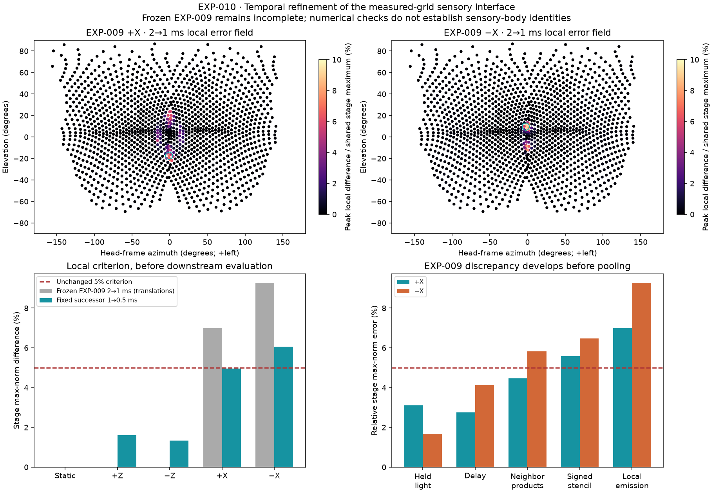

# EXP-010 — Translation sampling in the measured-grid sensory interface

## Question and result

Can the broader measured-grid representation become numerically trustworthy
under EXP-009's unchanged biological assumptions by refining sensory timing?

**Not yet.** The single predeclared 1 ms production / 0.5 ms reference candidate
reduces the translation local-stage discrepancies to **4.952% (+X)** and
**6.063% (−X)**. The latter still exceeds the unchanged **5%** criterion.
EXP-009 remains a frozen incomplete result; EXP-010 records a localized
numerical failure, not a correction to its biology or a falsification of vision.
The failed candidate is not evaluated as an integrated validation result.



## Method and predeclared comparison

The [specification](../experiments/EXP-010-retinotopic-refinement/specification.json)
was written before new downstream evaluation. It declares one candidate, fixed
controls, a valid negative result, and diagnostic-only interventions.

All 1,709 measured facet directions and 1,500 complete neighborhoods, the
5-degree acceptance kernel, 5×24 quadrature, scene, motion, adaptation/delay/
emission filters and shared-type adapter are unchanged. Physiological parameters
and chemical/electrical connectivity in EXP-005/004 are unchanged. Only sensory
sampling resolution is a candidate refinement; halving neural timestep is a
separate numerical check, not a model-parameter fit.

New scalar rays are sampled at odd half-millisecond poses. Coincident 1 ms
samples reuse verified EXP-008 light and match fresh ray checks exactly. Light is
causally held on a common 0.5 ms neural grid. Local emissions are compared at
coincident 2 ms output times; no temporal interpolation enters the model.
Relative error is `max|a−b| / max(max|a|, max|b|, 1e−12)` at each stage.
Different stages have different normalizers; percentages are not biological
gains or estimates of calcium error.

An independent transfer-function reconstruction checks before-update
adaptation/delay states and exposes the six raw neighbor products and signed
local b/d stencils. Tests compare it with scalar Euler recurrences and the
frozen emission kernel. It is read-only instrumentation, not replacement dynamics.

## Where the original discrepancy appears

Original 2 ms and 1 ms physical samples are **identical at coincident times**.
The first nonzero difference is the causal hold between samples. At coincident
neural output times, the delayed product/stencil representation makes the
difference material before pooling:

| Stage, original 2→1 ms | +X | −X |
|---|---:|---:|
| Causally held light | 3.110% | 1.674% |
| Adaptation | 0.144% | 0.070% |
| Rectified highpass | 1.321% | 1.439% |
| Delayed signal | 2.745% | 4.124% |
| Six raw neighbor correlators | 4.467% | 5.831% |
| Signed b/d stencil | 5.594% | 6.471% |
| Rectified, filtered local emission | 6.976% | 9.267% |
| Pooled channels | 2.829% | 1.601% |
| LPi | 1.015% | 0.995% |
| HS/H2 drive | 1.854% | 1.725% |
| Central states | 1.046% | 1.118% |
| Both DNp15 states (shared DN normalizer) | 0.845% | 0.905% |

Thus +X first crosses 5% in the signed spatial stencil; −X already crosses it
in raw correlators. The later pooling and downstream filters hide the local
failure rather than establish its validity. Original refined-input DNp15 traces
are replayed only to complete this diagnosis; their error and deterministic
digests are in the [record](../experiments/EXP-010-retinotopic-refinement/record.json).
They do not select or qualify the candidate.

## Spatial localization and numerical mechanism

The original maximum remains facet **400, R, grid (−14,0), OFF/d at 3886 ms**
for +X and **711, L, grid (−5,9), ON/c at 2320 ms** for −X. These are measured
lens-array indices, not MaleCNS bodies. Only **13 / 14 of 1,500 neighborhoods**
exceed 5% of the shared local-stage maximum. The top 1% of neighborhoods
accounts for **72.5% / 80.0%** of squared local error: the error is concentrated,
not a uniform full-eye discrepancy. The record preserves ten peak-ranked
neighborhoods for each translation.

Neighborhood peak error correlates with the largest local light jump
(descriptive Pearson r **0.789 / 0.668**), but weakly with maximum angular
spacing (**−0.116 / −0.058**) or basis skew (**0.059 / 0.109**). These are
descriptive associations, not independent causal tests. Measured spacing and
nonorthogonal bases remain unchanged; no fabricated finer spatial grid is used.
Conservative acceptance-cone/occluder overlap and smooth-wall contrast
localization are reported separately from actual ray visibility.
The potential-occlusion regions contain 184 / 100 neighborhoods and account for
**99.4% / 86.3%** of local error energy; all ten peak-ranked neighborhoods lie
inside those regions in each translation.

The interventions use the two **original** maximum-error neighborhoods,
including their actual neighbors, under both translations. They are diagnostics
only; none is adopted into the scientific model:

| Intervention | +X absolute error at facet 400 | −X absolute error at facet 711 |
|---|---:|---:|
| Original 5×24 quadrature | 3.807e−5 | 1.097e−5 |
| 9×64 quadrature | 1.621e−5 | 2.852e−6 |
| 17×128 quadrature | 9.572e−6 | 1.174e−6 |
| Remove opaque occluder | 9.326e−11 | 1.115e−10 |
| Common lens origin, preserve finite-scene translation | 3.511e−5 | 9.416e−6 |

Removing the blocker almost eliminates the **absolute** hotspot discrepancy;
the smooth painted-wall texture alone is not its dominant source. The physical
translation sweeps an opaque boundary through acceptance rays. Finite quadrature
turns changes in ray visibility into intensity steps (up to 0.026 and 0.0139 per
1 ms in these neighborhoods). Higher quadrature reduces jumps and local error,
but does not demonstrate full-eye optical convergence. Removing inter-facet
lens-origin differences does not remove the failure: that particular parallax
approximation is not the dominant cause. Finite-distance occluder motion still
exists in that diagnostic.

The causal hold and stable adaptation/delay filters transform those input
steps into changed neighbor products. Stencil cancellation, rectification and
smaller emission normalizers increase **relative** error; this is not recurrent
instability or an output normalization inserted to manufacture contrast.
Neural 0.5→0.25 ms local errors remain below 1.4% under the fixed candidate,
well below the translation sensory errors. Sensory timing plus finite
acceptance quadrature at occlusion boundaries is the limiting numerical
interface. Remaining sensitivity of the smooth geometry/local stencil cannot
be excluded; two neighborhoods do not prove global optical accuracy.

## Identity evidence and remaining biological boundary

Fresh inspection of [Nern et al. 2025 and its supplementary tables](https://www.nature.com/articles/s41586-025-08746-0)
and the pinned [author column export](https://github.com/reiserlab/male-drosophila-visual-system-connectome-code/blob/dbafc73124b5c96e96429cdf2a89d067cae841bc/results/exchange/ME_assigned_columns.csv)
strengthens the evidence beyond EXP-009's annotation-table inspection:

- All **13,267** released column-assigned bodies resolve with matching types in
  the current MaleCNS table, including **887 Mi1** cells.
- Supplementary Table 4 provides **832 / 839 / 856 / 835** right-eye T4a/b/c/d
  assignments to Mi1 bodies. All resolve with the expected current subtype and
  side and can inherit the source Mi1 hex address. The paper's analysis subset
  retains **770 / 780 / 760 / 763** of those assignments. These are anatomical
  assignment estimates, not individual measured receptive fields.
- The supplied annotation hex fields remain absent for all **13,580 T4/T5**
  rows. This table omission does **not** mean no body-to-column evidence exists.
- The current MaleCNS supplemental workbook matches the already pinned file
  and contains 892 right-medulla L1/R7/R8 rows, not a bilateral T4/T5 map.

[Zhao et al.](https://doi.org/10.1038/s41586-025-09276-5) registers a measured eye
to **FAFB** medulla columns from another individual. Its literal lens/column
indices are not MaleCNS IDs. Author male hex/PQ origins and available
[native/template skeleton transforms](https://male-cns.janelia.org/download/)
do not by themselves validate this sensory-grid registration. Type matching or
connectivity-inferred spatial correspondence is not an individual facet crosswalk.
No measured-eye→MaleCNS individual mapping, left/T5 registration or full neural
superposition reconstruction is established. No anatomical edges are changed.
Exact provenance and counts are in
[identity evidence](../experiments/EXP-010-retinotopic-refinement/identity-evidence.json).

## Controls, reproduction and conclusion

Static/flicker null, contrast ON/OFF exchange, causal-prefix, determinism and
bounded-filter preflights pass. The existing independent analytic reversal and
scalar-kernel tests are retained. All moving conditions activate both eyes and
polarities. Eye disconnection removes local activity exactly; diagnostic
motion/central disconnections remove downstream activity without changing
surviving operators. Frozen LPi/central preflight bounds and zero-input decay pass.

```powershell
.venv\Scripts\python.exe scripts\prepare_exp010_identity.py --download --check-evidence
# Production only when new reference samples are absent:
.venv\Scripts\python.exe scripts\render_exp010_reference.py
# Exact verification: reuse saved light, no full-eye world rerender:
.venv\Scripts\python.exe scripts\run_exp010_refinement.py --check-record
```

Bulk sensory and diagnostic traces remain ignored. The compact figure is
derived from the verified saved-input calculations, not an independent model.

**Conclusion:** translation error is localized and explained, but the fixed
temporal refinement does not resolve the original criterion. The minimum next
numerical work is a separately predeclared full-eye acceptance-integration /
temporal convergence study at occlusion boundaries, not visual gain tuning.
Individual eye-grid registration is a separate biological task; neither is
resolved by small downstream trace differences. No motor or closed-loop work is
performed.
